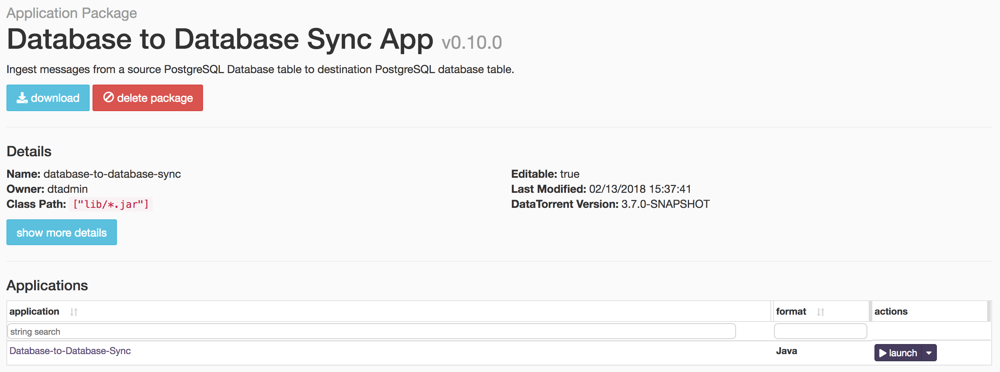
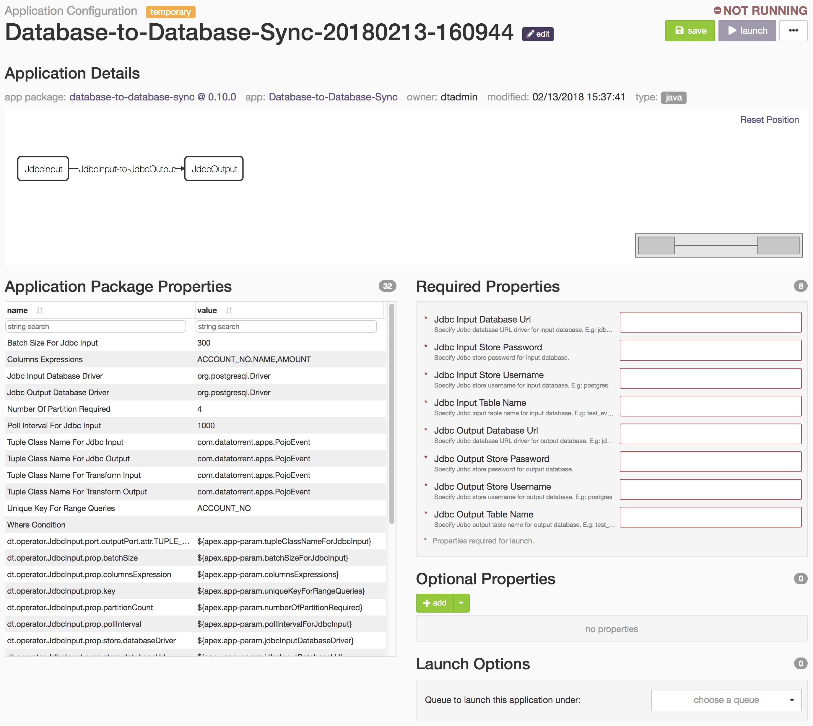
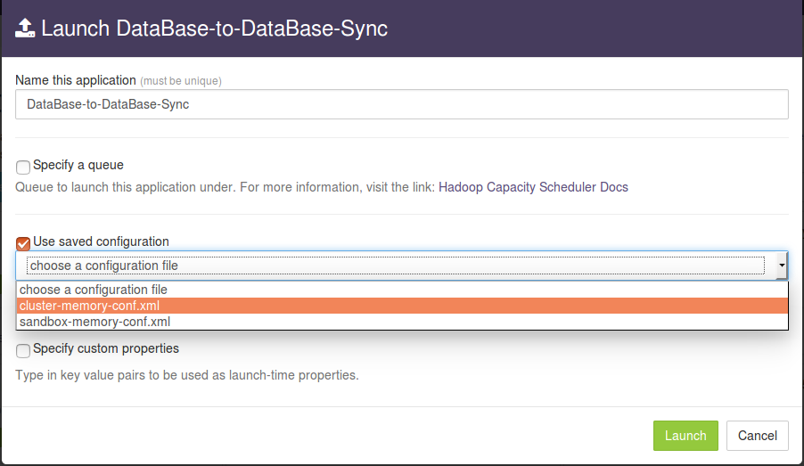
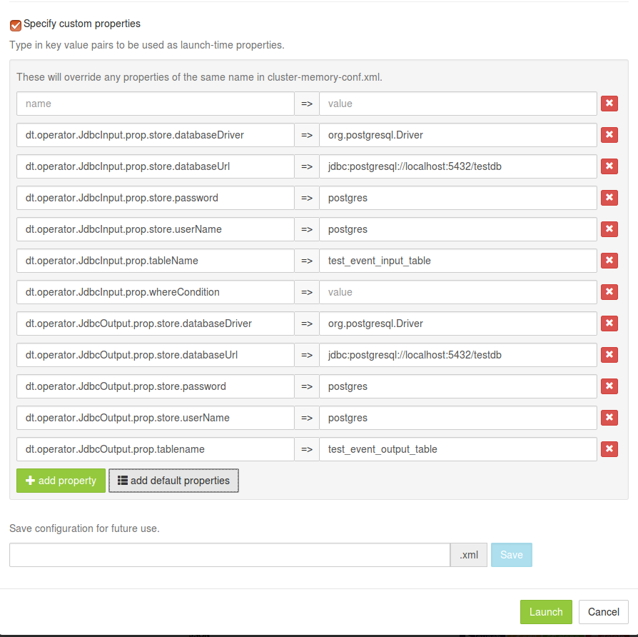
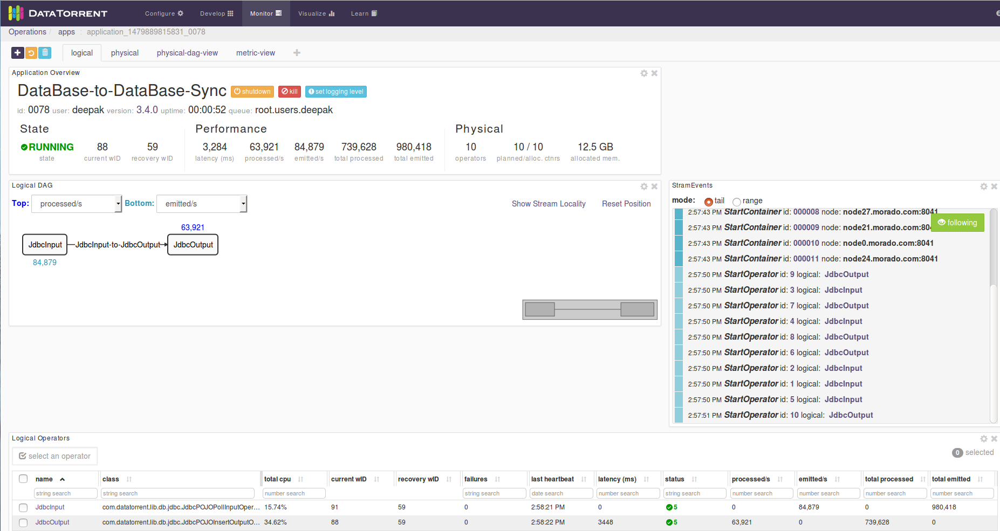
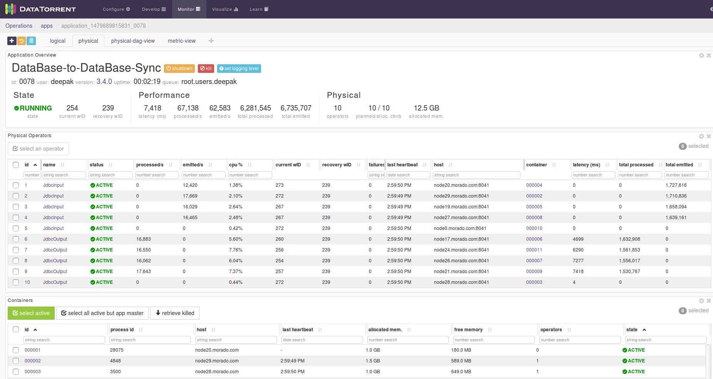

# Database to Database Sync application

## Summary

Ingest records from a source PostgreSQL Database table to destination PostgreSQL database table. This application reads messages from configured PostgreSQL table and writes each record to output PostgreSQL table.

 The source code is available at:
[https://github.com/DataTorrent/app-templates/tree/master/database-to-database-sync](https://github.com/DataTorrent/app-templates/tree/master/database-to-database-sync).

Please send feedback or feature requests to: [feedback@datatorrent.com](mailto:feedback@datatorrent.com)

This document has a step-by-step guide to configure, customize, and launch this application.

## <a name="steps_to_launch">Steps to launch application</a>

1. Click on the AppFactory tab from the top navigation bar.
   

1. Page listing the applications available on AppFactory is displayed.
Search for Database to see all applications related to Database.
   

    Click on import button for `Database to Database Sync App`

1. Notification is displayed on the top right corner after application package is successfully
   imported.
   

1. Click on the link in the notification which navigates to the page for this application package.
   

    Detailed information about the application package like version, last modified time, and short description is available on this page. Click on launch button for `Database-to-Database-Sync` application.

1. <a name="launch-dialogue"></a>`Launch Database-to-Database-Sync` dialogue is displayed. One can configure the name of this instance of the application from this dialogue.
   

1. Select `Use saved configuration` option to display a list of pre-saved configurations.
Please select `sandbox-memory-conf.xml` or `cluster-memory-conf.xml` depending on whether
your environment is the DataTorrent sandbox, or other cluster.
    

1. Select `Specify custom properties` option. Click on `add default properties` button.
   

1. This expands a key-value editor pre-populated with mandatory properties for this
application. Change values as needed.
   

    <a name="property-editor"></a>
    For example, suppose we wish to process all rows from the table `test_event_input_table` in a
    PostgreSQL database named `testdb` accessible at `source-database-node.com` port `5432` with credentials
    username=`postgres`, password=`postgres`, and we wish to write the output records to other
    PostgreSQL database table `test_event_output_table` accessible at `destination-database-node.com` port `5432` with same creditials listed above. Properties should be set as follows:

    |Name|Value|
    |---|---|
    |dt.operator.JdbcInput.prop.store.databaseDriver|org.postgresql.Driver|
    |dt.operator.JdbcInput.prop.store.databaseUrl|jdbc:postgresql://source-database-node.com:5432/testdb|
    |dt.operator.JdbcInput.prop.store.password|postgres|
    |dt.operator.JdbcInput.prop.store.userName|postgres|
    |dt.operator.JdbcInput.prop.tableName|test_event_input_table|
    |dt.operator.JdbcInput.prop.whereCondition||
    |dt.operator.JdbcOuput.prop.store.databaseDriver|org.postgresql.Driver|
    |dt.operator.JdbcOuput.prop.store.databaseUrl|jdbc:postgresql://destination-database-node:5432/testdb|
    |dt.operator.JdbcOuput.prop.store.password|postgres|
    |dt.operator.JdbcOuput.prop.store.userName|postgres|
    |dt.operator.JdbcOuput.prop.tablename|test_event_output_table|

    Details about configuration options are available in [Configuration options](#configuration_options) section.

1. Click on the `Launch` button at the lower right corner of the dialog to launch the
application.
A notification is displayed on the top right corner after the application is launched successfully and includes the Application ID which can be used to monitor this instance and to find
its logs.
   

1. Click on the `Monitor` tab from the top navigation bar.
   

1. A page listing all running applications is displayed. Search for the current instance based on name or application id or any other relevant field. Click on the application name or id to navigate to the details page.
   
1. Application instance details page shows key metrics for monitoring the application status.
   `logical` tab shows application DAG, StrAM events, operator status based on logical operators, stream status, and a chart with key metrics.
   
1. Click on the `physical` tab to look at the status of physical instances of operators, containers etc.
   

## <a name="configuration_options">Configuration options</a>

### Prerequistes
`Meta-data` table is required for Jdbc Output operator for transactional data and application consistency.

|Table Name|Column Names|
|---|------|
|dt_meta|<br/>dt_app_id (VARCHAR)<br/>dt_operator_id (INT) <br/>dt_window (BIGINT)|

Query for `Meta-data` table creation:

`CREATE TABLE dt_meta (dt_app_id varchar(100) NOT NULL,
dt_operator_id int NOT NULL, dt_window bigint NOT NULL,
CONSTRAINT dt_app_id UNIQUE (dt_app_id,dt_operator_id,dt_window));`

### Mandatory properties
End user must specify the values for these properties.

|Property|Description|Type|Example|
|---|---|---|---|
|dt.operator.JdbcInput.prop.store.databaseDriver|JDBC driver class. This has to be on CLASSPATH. PostgreSQL driver is added as a dependency.|String|org.postgresql.Driver|
|dt.operator.JdbcInput.prop.store.databaseUrl|JDBC connection URL| String|jdbc:postgresql://node1.company.com:5432/testdb|
|dt.operator.JdbcInput.prop.store.password|Password for Database credentials| String|postgres|
|dt.operator.JdbcInput.prop.store.userName|Username for Database credentials| String|postgres|
|dt.operator.JdbcInput.prop.tableName|Table name for input records|String|test_event_input_table|
|dt.operator.JdbcInput.prop.whereCondition|Where clause condition (if any) for input records. Keep blank to fetch all records.|String||
|dt.operator.JdbcOuput.prop.store.databaseDriver|JDBC driver class. This has to be on CLASSPATH. PostgreSQL driver is added as a dependency.|String|org.postgresql.Driver|
|dt.operator.JdbcOuput.prop.store.databaseUrl|JDBC connection URL| String|jdbc:postgresql://node2.company.com:5432/testdb|
|dt.operator.JdbcOuput.prop.store.password|Password for Database credentials| String|postgres|
|dt.operator.JdbcOuput.prop.store.userName|Username for Database credentials| String|postgres|
|dt.operator.JdbcOuput.prop.tableName|Table name for output records|String|test_event_output_table|


### Advanced properties
There are pre-saved configurations based on the application environment. Recommended settings for [datatorrent sandbox edition](https://www.datatorrent.com/download/datatorrent-rts-sandbox-edition-download/) are in `sandbox-memory-conf.xml` and for a cluster environment in `cluster-memory-conf.xml` (the first 2 are integers and the rest are strings).
The messages or records emitted are specified by the value of the `TUPLE_CLASS` attribute in the configuration file namely `PojoEvent` in this case.

|Property|Description|Default for<br/> cluster<br/>-memory<br/>- conf.xml|Default for<br/>  sandbox<br/>-memory<br/> -conf.xml|
|---|---|---|---|
|<p style="font-size:12px">dt.operator.JdbcInput.prop.partitionCount|Number of JDBC input partitions for parallel reading.|4|1|
|<p style="font-size:12px">dt.operator.JdbcInput.prop.batchSize|Batch size to read data from JDBC.|300|300|
|<p style="font-size:12px">dt.operator.JdbcInput.prop.key|Key column for the table. This will be used for partitoning of rows.|ACCOUNT_NO|ACCOUNT_NO|
|<p style="font-size:12px">dt.operator.JdbcInput.prop.columnsExpression|Key column for the table. This will be used for partitoning of rows.|ACCOUNT_NO, NAME, AMOUNT|ACCOUNT_NO, NAME, AMOUNT|
|<p style="font-size:12px">dt.operator.JdbcInput.port.outputPort.attr.TUPLE_CLASS|Fully qualified class name for the tuple class POJO(Plain old java objects) emitted by JDBC input|com.datatorrent.apps.PojoEvent|com.datatorrent.apps.PojoEvent|
|<p style="font-size:12px">dt.operator.JdbcInput.prop.pollInterval|Poll interval for scanning new records in milisec|1000|1000|
|<p style="font-size:12px">dt.operator.JdbcOutput.port.input.attr.TUPLE_CLASS|Fully qualified class name for the tuple class POJO(Plain old java objects) emitted by JDBC input|com.datatorrent.apps.PojoEvent|com.datatorrent.apps.PojoEvent|


You can override default values for advanced properties by specifying custom values for these properties in the step [specify custom property](#property-editor) step mentioned in [steps](#steps_to_launch) to launch an application.

## Steps to customize the application

1. Make sure you have following utilities installed on your machine and available on `PATH` in environment variable:
    - [Java](https://www.java.com/en/download/manual.jsp) : 1.7.x
    - [maven](http://maven.apache.org/download.cgi) : 3.0 +
    - [git](https://git-scm.com/book/en/v2/Getting-Started-Installing-Git) : 1.7 +
    - [Hadoop]( http://www.michael-noll.com/tutorials/running-hadoop-on-ubuntu-linux-single-node-cluster/) (Apache-2.2)+

1.  Use following command to clone the examples repository:

     ```
     git clone git@github.com:DataTorrent/app-templates.git
     ```

1. Change directory to `examples/tutorials/database-to-database-sync`:

    ```
    cd examples/tutorials/database-to-database-sync
    ```

1. Import this maven project in your favorite IDE (e.g. eclipse).

1. Change the source code as per your requirements. Some tips are given as commented blocks in the `Application.java` for this project.

1. Make respective changes in the test case and `properties.xml` based on your environment.

1. Compile this project using maven:

    ```
    mvn clean package
    ```

    This will generate the application package file with `.apa` extension in the `target` directory.

1. Go to DataTorrent UI Management console on web browser. Click on the `Develop` tab from the top navigation bar.
    
1. Click on `upload package` button and upload the generated `.apa` file.
    

1. Application package page is shown with the listing of all packages. Click on the `Launch` button for the uploaded application package. Follow the [steps](#launch-dialogue) for launching an application.
