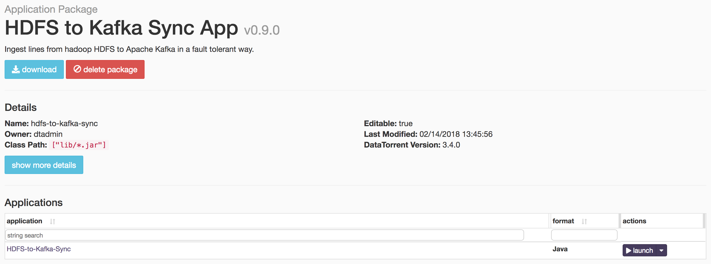
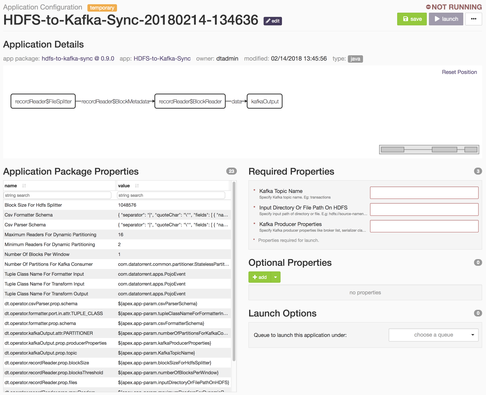
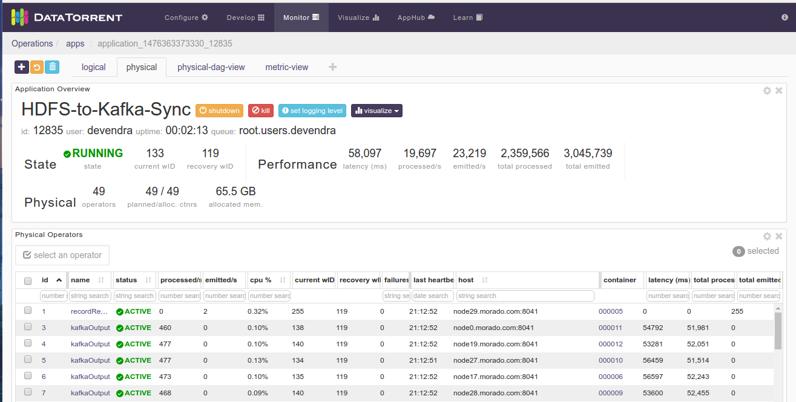

# HDFS to Kafka Sync App

## Summary

This application reads lines from configured HDFS path and writes each line as a message in configured Apache Kafka topic.
This document illustrates step by step guide to launch, configure, customize
this application.The source code is available at: [https://github.com/DataTorrent/app-templates/tree/master/hdfs-to-kafka-sync](https://github.com/DataTorrent/app-templates/tree/master/hdfs-to-kafka-sync).

Please send feedback or feature requests to: [feedback@datatorrent.com](mailto:feedback@datatorrent.com)

## <a name="steps_to_launch">Steps to launch application</a>

1. Click on the AppHub tab from the top navigation bar.
   

1. Page listing the applications available on AppHub is displayed.
Search for Kafka to see all applications related to Kafka.
   
    Click on import button for `HDFS to Kafka Sync App`

1. Notification is displayed on the top right corner after application package is successfully
   imported.
   

1. Click on the link in the notification which navigates to the page for this application package.
   
    Detailed information about the application package like version, last modified time, and short description is available on this page. Click on launch button for `HDFS to Kafka Sync` application.

1. <a name="launch-dialogue"></a>`Launch HDFS-to-Kafka-Sync` dialogue is displayed. One can configure name of this instance of the application from this dialogue.
   

1. Select `Use saved configuration` option. This displays list of pre-saved configurations.
Please select `sandbox-memory-conf.xml` or `cluster-memory-conf.xml` depending on whether
your environment is the DataTorrent sandbox, or other cluster.
   

1. Select `Specify custom properties` option. Click on `add default properties` button.
   

1. This a expands key-value editor pre-populated with mandatory properties for this application. Change values as needed.
   
   <a name="property-editor"></a>
   For example, suppose we wish to process lines from all files in `/user/appuser/input` from `source-cluster` and send the output to kafka on `kafka-server-node` with topic `test`. Properties should be set as follows:

    |name|value|
    |-|-|
    |dt.operator.kafkaOutput.prop.producerProperties|serializer.class=kafka.serializer. DefaultEncoder,<br/>producer.type= async,<br/>metadata.broker. list=kafka-server-node:9092|
    |dt.operator.kafkaOutput.prop.topic|test|
    |dt.operator.recordReader.prop.files|/user/appuser/input|

    Details about configuration options are available in [Configuration options](#configuration_options) section.

1. Click on `Launch` button on lower right corner to launch the application.
Notification is displayed on the top right corner after application is launched successfully and includes the Application ID which can be used to monitor this instance and find its logs.
   

1. Click on the `Monitor` tab from the top navigation bar.
   

1. A page listing all running applications is displayed. Search for current application based on name or application id or any other relevant field. Click on the application name or id to navigate to application instance details page.
   
1. Application instance details page shows key metrics for monitoring the application status.
   The `logical` tab shows application DAG, Stram events, operator status based on logical operators, stream status, and a chart with key metrics.
   

1. Click on the `physical` tab to look at the status of physical instances of the operator, containers etc.
   

## <a name="configuration_options">Configuration options</a>

### Mandatory properties
End user must specify the values for these properties.

|Property|Description|Type|Example|
|-|-|-|-|
|dt.operator.kafkaOutput. prop.producerProperties|Properties for Kafka producer|Comma separated String|serializer.class=kafka.serializer.DefaultEncoder, producer.type=async,<br>metadata.broker.list=kafka-server-node:9092|
|dt.operator.kafkaOutput .prop.topic|Kafka topic for output records| String|test|
|dt.operator.recordReader<br/>prop.files|HDFS path for input file or directory| String|<ul><li>/user/appuser/input/directory1</li><li>/user/appuser/input/file2.log</li><li>hdfs://node1.corp1.com/user/appuser/input</li></ul>|

### Advanced properties
There are pre-saved configurations based on the application environment. Recommended settings for [datatorrent sandbox edition](https://www.datatorrent.com/download/datatorrent-rts-sandbox-edition-download/) are in `sandbox-memory-conf.xml` and for a cluster environment in `cluster-memory-conf.xml`.

|Property|Description|Type|Cluster default|Sandbox default|
|-|-|-|-|-|
|<p style="font-size:12px">dt.operator.recordReader.prop.minReaders|Minimum number of BlockReader partitions for parallel reading.|int|1|1|
|<p style="font-size:12px">dt.operator.recordReader.prop.maxReaders|Maximum number of BlockReader partitions for parallel reading.|int|16|1|
|<p style="font-size:12px">dt.operator.kafkaOutput.attr.PARTITIONER|Partitoning for Kafka output operator| String|_See_ (1)|_See_ (2)|

1. _Cluster default_: <tt><b>com.datatorrent.common.partitioner.StatelessPartitioner:16</b></tt>
2. _Sandbox default_: <tt><b>com.datatorrent.common.partitioner.StatelessPartitioner:1</b></tt>

You can override default values for advanced properties by specifying custom values for these properties in the step [specify custom property](#property-editor) step mentioned in [steps](#steps_to_launch) to launch an application.

## Steps to customize the application

1. Make sure you have following utilities installed on your machine and available on `PATH` in environment variables
    - [Java](https://www.java.com/en/download/manual.jsp) : 1.7.x
    - [maven](http://maven.apache.org/download.cgi) : 3.0 +
    - [git](https://git-scm.com/book/en/v2/Getting-Started-Installing-Git) : 1.7 +
    - [Hadoop]( http://www.michael-noll.com/tutorials/running-hadoop-on-ubuntu-linux-single-node-cluster/) (Apache-2.2)+

1. Use following command to clone the examples repository:

    ```
    git clone git@github.com:DataTorrent/app-templates.git
    ```

1. Change directory to `examples/tutorials/hdfs-to-kafka-sync`:

    ```
    cd examples/tutorials/hdfs-to-kafka-sync
    ```

1. Import this maven project in your favorite IDE (e.g. eclipse).

1. Change the source code as per your requirements. Some tips are given as commented blocks in `Application.java` for this project.

1. Make respective changes in the test case and `properties.xml` based on your environment.

1. Compile this project using maven:
    ```
    mvn clean package
    ```

    This will generate the application package with the `.apa` extension inside the `target` directory.

1. Go to DataTorrent UI Management console on web browser. Click on the `Develop` tab from the top navigation bar.
   

1. Click on `upload package` button and upload the generated `.apa` file.
   

1. Application package page is shown with the listing of all packages. Click on the `Launch` button for the uploaded application package. Follow the [steps](#launch-dialogue) for launching an application.
