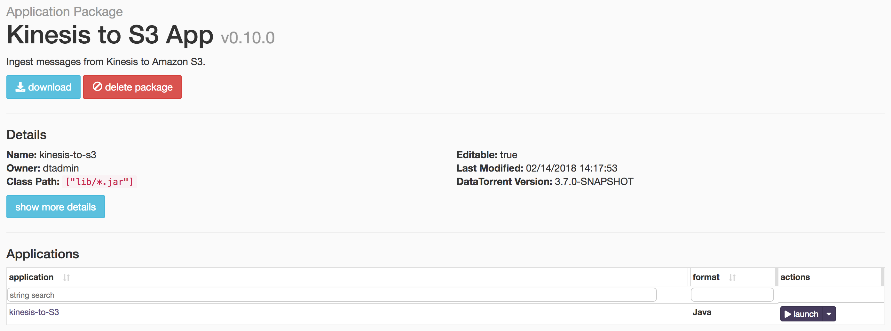
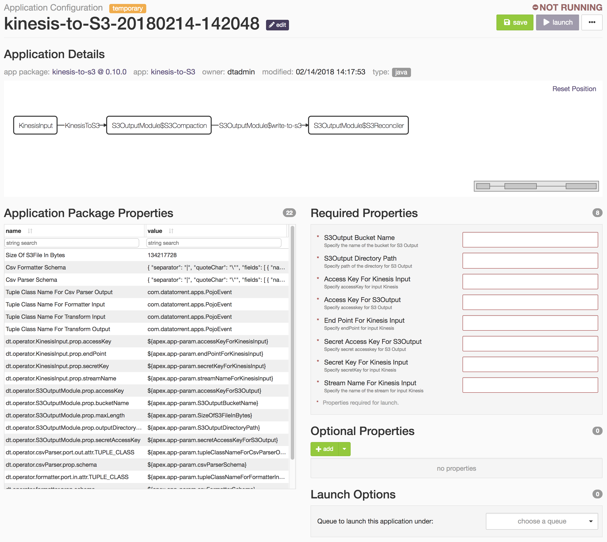
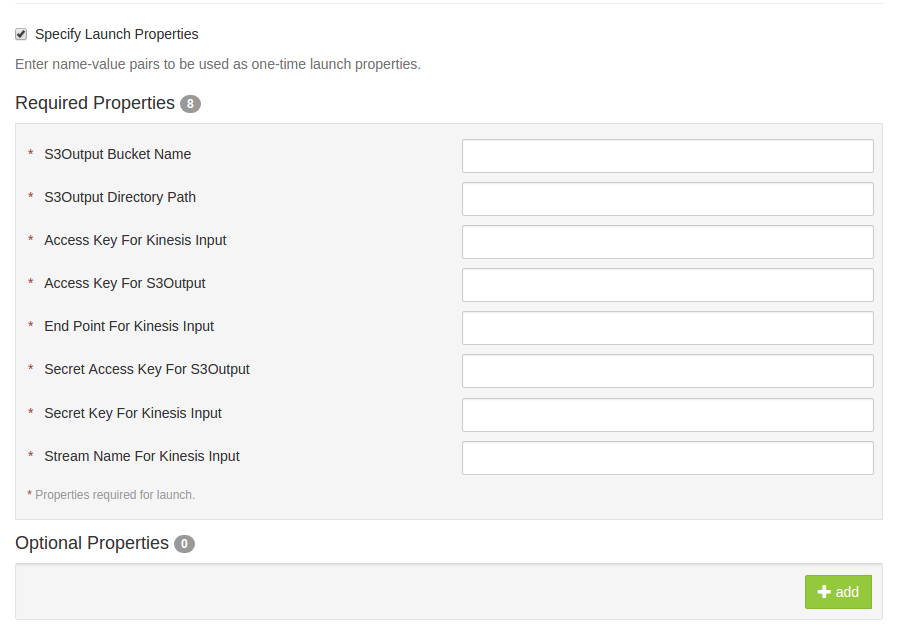
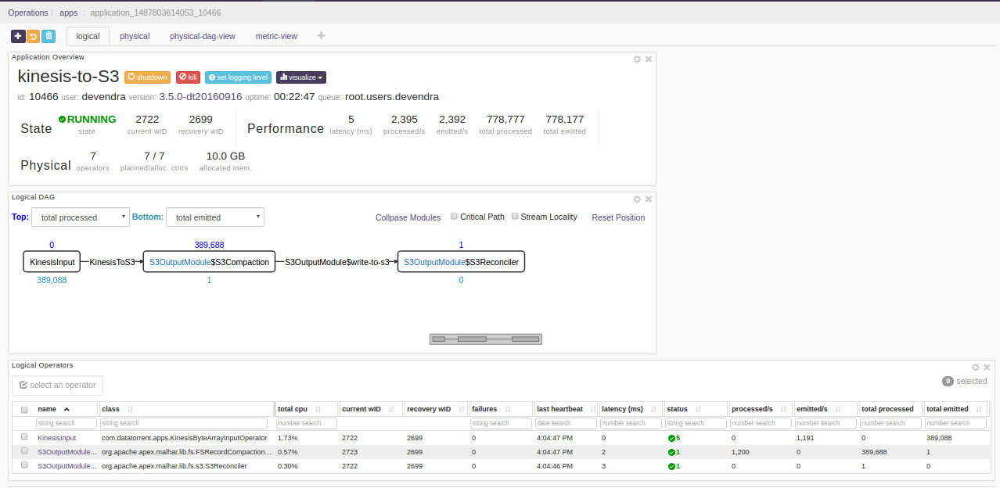

# Kinesis to S3 Application

## Summary
Ingest messages from kinesis and write to S3 bucket.
The source code is available at: [https://github.com/DataTorrent/app-templates/tree/master/kinesis-to-s3.](https://github.com/DataTorrent/app-templates/tree/master/kinesis-to-s3)

Please send feedback or feature requests to: [feedback@datatorrent.com](mailto:feedback@datatorrent.com)

This document has a step-by-step guide to configure, customize, and launch this application.

## <a name="steps_to_launch">Steps to launch application</a>

1. Click on the AppFactory tab from the top navigation bar.
   

1. Page listing the applications available on AppFactory is displayed.
Search for Kinesis to see all applications related to Kinesis.
   
   Click on import button for `Kinesis to S3 App`.

1. Notification is displayed on the top right corner after application package is successfully
   imported.
   

1. Click on the link in the notification which navigates to the page for this application package.
   
   Detailed information about the application package like version, last modified time, and short description is available on this page. Click on launch button for `kinesis-to-S3` application.

1. <a name="launch-dialogue"></a>`Launch Kinesis-to-S3` dialogue is displayed. One can configure name of this instance of the application from this dialogue.
   

1. Select `Specify Launch properties` option. This expands a key-value editor with mandatory properties for this application. 
   

1. Specify the mandatory properties under `Specify Launch Properties`
   
   <a name="property-editor"></a>
   For example, suppose we wish to process all messages from Kinesis stream `transactions` 
      and write them to `output.txt` under `/user/appuser/output` on S3. Properties should be set as follows:

    |name|value|
    |---|---|
    |Stream Name For Kinesis Input|transactions|
    |Access Key For Kinesis Input|KINESIS_ACCESS_KEY|
    |Secret Key For Kinesis Input|KINESIS_SECRET_KEY|
    |End Point For Kinesis Input|KINESIS_END_POINT|
    |Access Key For S3Output|S3_ACCESS_KEY|
    |Secret Access Key For S3Output|S3_SECRET_KEY|
    |S3Output Bucket Name|S3_BUCKET_NAME|
    |S3Output Directory Path|/user/appuser/output|

    Details about configuration options are available in [Configuration options](#configuration_options) section.

1. Click on the `Launch` button on lower right corner of the dialog to launch the application.
A notification is displayed on the top right corner after application is launched successfully and includes the Application ID which can be used to monitor this instance and find its logs.
   

1. Click on the `Monitor` tab from the top navigation bar.
   

1. A page listing all running applications is displayed. Search for current application based on name or application id or any other relevant field. Click on the application name or id to navigate to application instance details page.
   

1. Application instance details page shows key metrics for monitoring the application status.
   `logical` tab shows application DAG, Stram events, operator status based on logical operators, stream status, and a chart with key metrics.
   

1. Click on the `physical` tab to look at the status of physical instances of the operator, containers etc.
   

## <a name="configuration_options">Configuration options</a>

### Mandatory properties
End user must specify the values for these properties.

|Property|Description|Type|Example|
|---|---|---|-----|
|Stream Name For Kinesis Input|Name of the stream from where the records to be fetched|String|transactions|
|Access Key For Kinesis Input|Indicates the accessKey which have read access to the Kinesis stream|String|KINESIS_ACCESS_KEY|
|Secret Key For Kinesis Input|Indicates the secret AccessKey which have read access to the Kinesis stream|String|KINESIS_SECRET_KEY|
|End Point For Kinesis Input|Indicates the endpoint of the kinesis stream|String|KINESIS_END_POINT|
|Access Key For S3Output|AWS access key which have write access to the S3 bucket|String|S3_ACCESS_KEY|
|Secret Access Key For S3Output|AWS Secret key which have write access to the S3 bucket|String|S3_SECRET_KEY|
|S3Output Bucket Name|Name of S3 bucket|Sting|S3_BUCKET_NAME|
|S3Output Directory Path|Output path for S3 files|String|/user/appuser/output|

## Steps to customize the application

1. Make sure you have following utilities installed on your machine and available on `PATH` in environment variables
    - [Java](https://www.java.com/en/download/manual.jsp) : 1.7.x
    - [maven](http://maven.apache.org/download.cgi) : 3.0 +
    - [git](https://git-scm.com/book/en/v2/Getting-Started-Installing-Git) : 1.7 +
    - [Hadoop]( http://www.michael-noll.com/tutorials/running-hadoop-on-ubuntu-linux-single-node-cluster/) (Apache-2.2)+

1.  Use following command to clone the examples repository:

     ```
     git clone git@github.com:DataTorrent/app-templates.git
     ```

1. Change directory to 'examples/tutorials/kinesis-to-s3':

    ```
    cd examples/tutorials/kinesis-to-s3
    ```

1. Import this maven project in your favorite IDE (e.g. eclipse).

1. Change the source code as per your requirements. Some tips are given as commented blocks in the Application.java for this project

1. Make respective changes in the test case and `properties.xml` based on your environment.

1. Compile this project using maven:

    ```
    mvn clean package
    ```

    This will generate the application package with `.apa` extension in the `target` directory.

1. Go to DataTorrent UI Management console on web browser. Click on the `Develop` tab from the top navigation bar.
   

1. Click on `upload package` button and upload the generated `.apa` file.
   

1. Application package page is shown with the listing of all packages.
Click on the `Launch` button for the uploaded application package.    
Follow the [steps](#launch-dialogue) for launching an application.
