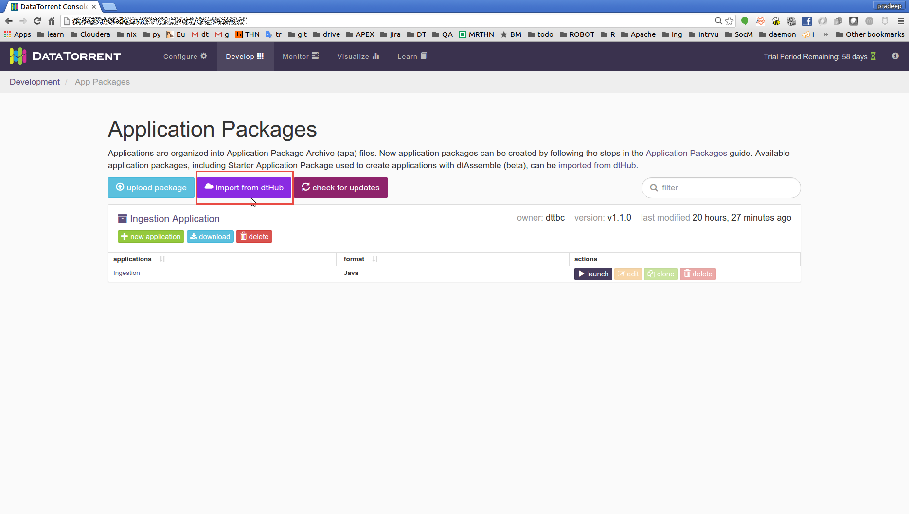
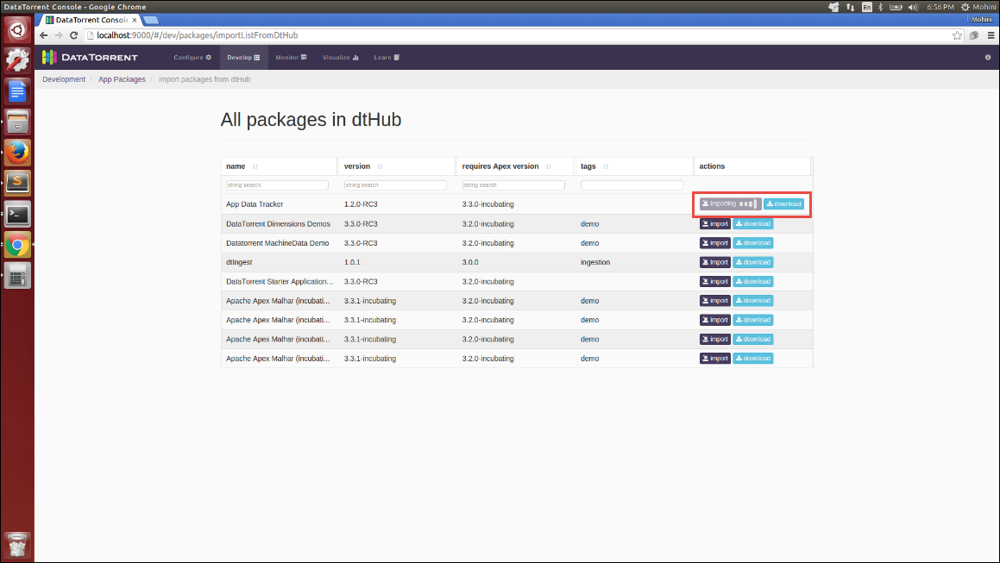
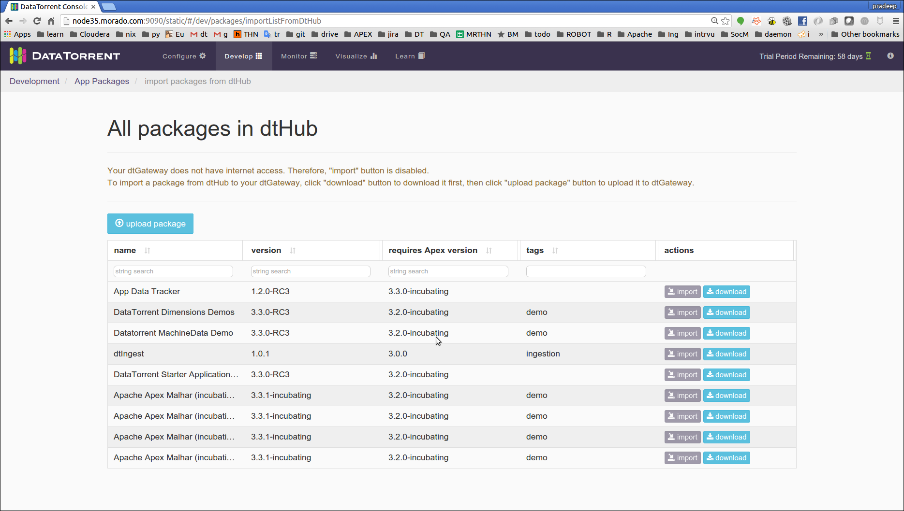
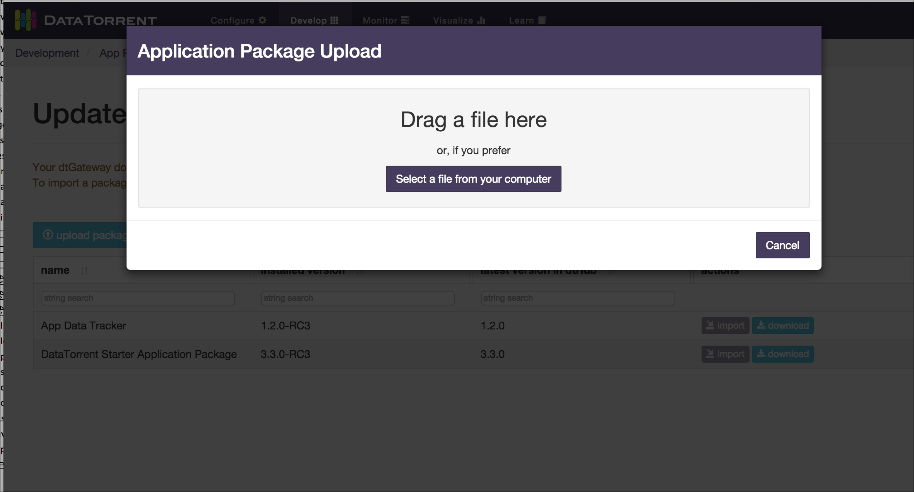
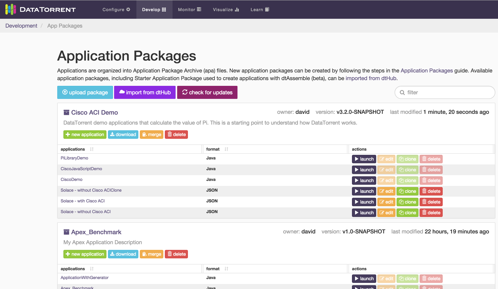
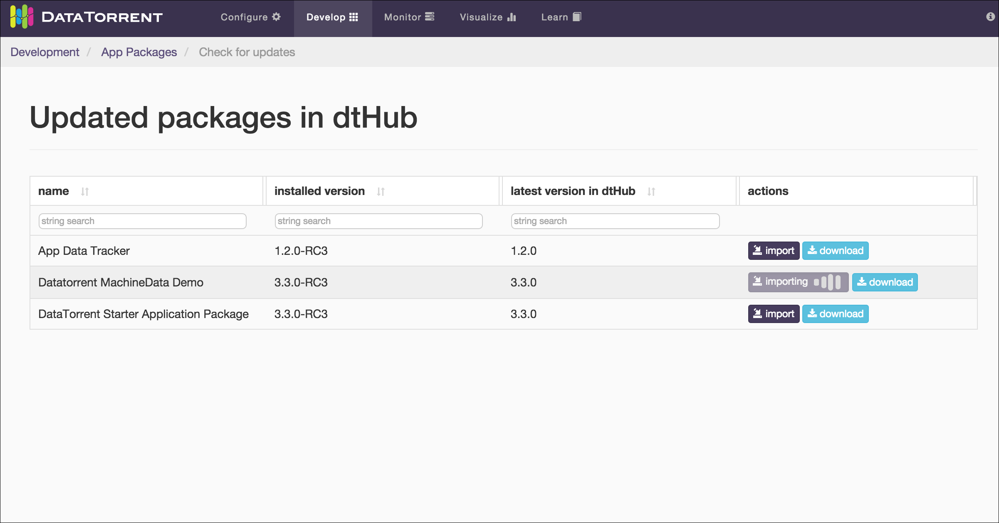
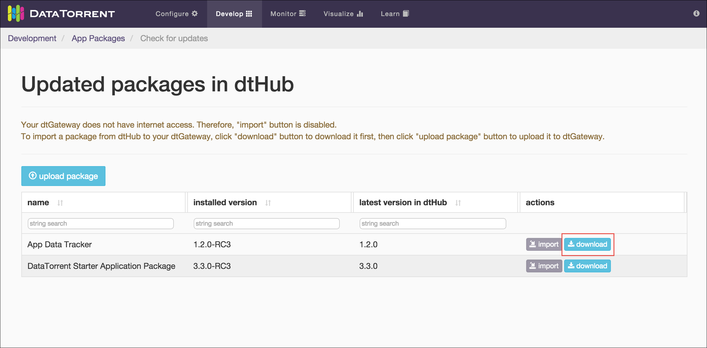

For end-users

# Overview

dtHub is a repository for application packages that DataTorrent hosts and maintains for distributing application packages and demonstration applications. It is a central location for applications and libraries that you can access through the DataTorrent RTS console. Using dtHub, you can browse through the list of available applications, and select the ones that you want to use. 

The top benefits of dtHub are:

**Decoupled installer and application packages**: Prior to the release of dtHub, the DataTorrent RTS installer came along with the default applications making it a heavier. With dtHub, applications are decoupled from the Datatorrent RTS installer, thus reducing the installer size significantly.

**Choose what you want**: An installation of Datatorrent RTS is no longer pre-packaged with applications. Instead, you can use dtHub to import only those default applications that you want.

**Get updates without a full upgrade**: You can use dtHub to quickly update the applications that you installed already. This eliminates the need for upgrading DataTorrent RTS.

## dtHub contents

As of version 3.3.0, dtHub distributes:

* App Data Tracker

* DataTorrent Dimensions Demo

* DataTorrent MachineData Demo

* dtIngest

* Datatorrent Starter Application Package

* Apache Apex Malhar Mobile Demo

* Apache Apex Malhar Pi Demo

* Apache Apex Malhar Twitter Demo

* Apache Apex Malhar Wordcount Demo

dtHub maintains a list of all the applications that you imported or uploaded. 

## Compatibility

dtHub is available as a part of the DataTorrent RTS 3.3.0 release. If you are using version 3*.x.x*,* *to use dtHub,* *you can perform a direct upgrade to version 3.3.0.

**Note**: An upgrade between major releases, is not supported. However, upgrades between minor releases or patch releases of a major releases are supported. For example, you cannot upgrade from version 2.0.0 to 3.0.0. However, you can perform a direct upgrade from version 3.0.0 to 3.3.0. If you are using an earlier major release of DataTorrent RTS, you must perform a staged upgrade. For assistance, contact DataTorrent Support ([support@datatorrent.com](mailto:support@datatorrent.com)) or get in touch with your account executive. 

# Using dtHub

You can use dtHub to:

* Import an application, or the App Data Tracker

* Download an application, App Data Tracker, or the Apache Apex Malhar library

* Check for updates to applications that you previously imported

* Import or download the most-recent version of existing application packages 
**Note**: After importing or downloading applications or libraries, you can use them just like you used to before. For example, you can perform operations such as launching the application, editing the application, cloning the application, and deleting the application. 

## Before you begin

Before using dtHub make sure that:

* (*Import option only*) There is internet connectivity for the cluster where dtGateway is running 

* (*For import and download options*) There is internet connectivity for the computer that you are using

* (*For import and download options*) You can access the DataTorrent RTS console from a browser on your computer

## Access dtHub

You can access dtHub from the DataTorrent RTS 3.3.0 console. 

1. In a browser, open the DataTorrent RTS console using a URL in the following format: 

http://<RTS installation host>:<port defined during installation>/

2. (*Authentication enabled*) Use your credentials to log on. 

3. On the menu bar, click **Develop**.

4. Click **import from dtHub**.



## Import packages using dtHub

To save the package in the Hadoop cluster where dtGateway is running, use the import option.** **An import operation saves the package on the Hadoop file system. 

1. In the list of packages, locate the package that you want.

2. Click **import**. 

The import button shows a progress bar indicating the progress of the import operation. After the import operation completes, a notification appears indicating that the import is complete.  

## Download packages using dtHub

If your Hadoop cluster where dtGateway is running does not have internet connectivity, the following message appears on the All packages in dtHub page: 
Your dtGateway does not have internet access. Therefore, "import" button is disabled. To import a package from dtHub to your dtGateway, click "download" button to download it first, then click "upload package" button to upload it to dtGateway.

 

If you see this message, use this procedure to obtain packages:

1. Download the application:

    1. In the list of packages, locate the package that you want.

    2. Click **download** to download the package to your local file system.

2. Upload the package that you downloaded:

    3. On the top of the application list, locate and click **upload package.** 

    4. On the Application Package Upload window, upload the package that you downloaded to the Hadoop cluster where dtGateway is running. 

    5. Wait till the upload completes before performing application operations.

## Check for updates

dtHub is periodically updated to enable distribution of the most-recent versions of available applications. To retrieve information about updates for applications that you currently have in the Hadoop cluster where dtGateway is running, use the **check for updates** option. 

**Note**: If an existing package has an update, and if you choose to upgrade it, the existing package is replaced with its most-recent release. 

1. In a browser, open the DataTorrent RTS console using a URL in the following format: 

http://<RTS installation host>:<port defined during installation>/

2. (*Authentication enabled*) Use your credentials to log on. 

3. On the menu bar, click **Develop**.

4. On the Application Packages page, click **check for updates**.

5. Import the application:

    1. In the list of applications, locate the application that you want.

    2. Click **import**. 

**Note**: The import button shows a progress bar indicating the progress of the import operation. After the import operation completes, a notification appears indicating that the import is complete.  

6. Download the application: 

    3. In the list of applications, locate the application that you want.

    4. Click **download** to download the application package to your local file system.

    5. On the top of the application list, locate and click **upload package**. 

    6. On the Application Package Upload window, upload the package that you downloaded to the Hadoop cluster where dtGateway is running. 

# dtHub RESTful APIs

dtHub web services are implemented as RESTful APIs. They are hosted on dthub.datatorrent.com, which is a CNAME for www.datatorrent.com. The REST APIs are enabled for Cross-Origin Resource Sharing (CORS).

The following dtHub APIs are exposed.

## Return available artifacts

<table>
  <tr>
    <td>Title</td>
    <td>Returns a list of available artifacts, depending on the query</td>
  </tr>
  <tr>
    <td>Method</td>
    <td>GET</td>
  </tr>
  <tr>
    <td>URL</td>
    <td>http://dthub.datatorrent.com/ws/v1/artifacts </td>
  </tr>
  <tr>
    <td>URL parameters</td>
    <td>id: The artifact ID
groupId: The group ID of the project 
artifactId: The artifact name
version: The version of the artifact
requiresApexVersion: The version of Apache Apex for which artifacts must be retrieved 
type: The type of the artifact, for example, "apa"
name: The name of the artifact
changes: The changes, if any, to the artifact value
description: A short description of the artifact that you want to retrieve 
time: The time when the RESTful API command is executed
tags: Additional tags for enabling search
requiredArtifacts: The mandatory artifacts
allVersions: (true | false - default)
q: search across anything</td>
  </tr>
  <tr>
    <td>Return</td>
    <td>{“artifacts”: 
[
{“groupId”, “{groupId}”, 
“name”: “{name}”,
“changes”: “{changes}”,
“description”: “{description}”,
“tags”: [ “{tag1}”, … ],
“type”: “{type}”,
“version”: “{version}”,
“requiresApexVersion”:“{requiresApexVersion}”,}, 
]
}</td>
  </tr>
  <tr>
    <td>Example</td>
    <td>curl -X GET -d http://dthub.datatorrent.com/ws/v1/artifacts
{"artifacts":[{"id":31,"groupId":"com.datatorrent","artifactId":"app-data-tracker","version":"1.2.0-RC3","type":"apa","name":"App Data Tracker","requiresApexVersion":"3.3.0-incubating","changes":null,"description":"A streaming application on top of Apex that exposes metrics from all other streaming applications in the App Data Framework","time":1457010079,"tags":[],"requiredArtifacts":[]} </td>
  </tr>
</table>

## Return artifact information

<table>
  <tr>
    <td>Title</td>
    <td>Returns information about the artifact specified using "name" and “groupId”</td>
  </tr>
  <tr>
    <td>Method</td>
    <td>GET</td>
  </tr>
  <tr>
    <td>URL</td>
    <td>http://dthub.datatorrent.com/ws/v1/artifacts/{groupId}/{name}?[parameters]</td>
  </tr>
  <tr>
    <td>URL parameters</td>
    <td>id: The artifact ID
groupId: The group ID of the project 
artifactId: The artifact name
version: The version of the artifact
requiresApexVersion: The version of Apache Apex for which artifacts must be retrieved 
type: The type of the artifact, for example, “apa”
name: The name of the artifact
changes: The changes, if any, to the artifact value
description: A short description of the artifact that you want to retrieve 
time: The time when the RESTful API command is executed
tags: Additional tags for enabling search
requiredArtifacts: The mandatory artifacts</td>
  </tr>
  <tr>
    <td>Return</td>
    <td>{“artifacts”: 
[
{“groupId”, “{groupId}”, 
“name”: “{name}”,
“changes”: “{changes}”,
“description”: “{description}”,
“tags”: [ “{tag1}”, … ],
“type”: “{type}”,
“version”: “{version}”,
“requiresApexVersion”:“{requiresApexVersion}”,}, 
]
}</td>
  </tr>
  <tr>
    <td>Example</td>
    <td>curl -X GET
http://dthub.datatorrent.com/ws/v1/artifacts/com.datatorrent/app-data-tracker
{"artifacts":[{"id":31,"artifactId":"app-data-tracker","version":"1.2.0-RC3","type":"apa","name":"App Data Tracker","requiresApexVersion":"3.3.0-incubating","changes":null,"description":"A streaming application on top of Apex that exposes metrics from all other streaming applications in the App Data Framework","time":1457010079,"tags":[],"requiredArtifacts":[]}</td>
  </tr>
</table>

## Return artifact information of a specific version

<table>
  <tr>
    <td>Title</td>
    <td>Returns information about the artifact specified using "name", “groupid”, and “version”</td>
  </tr>
  <tr>
    <td>Method</td>
    <td>GET</td>
  </tr>
  <tr>
    <td>URL</td>
    <td>http://dthub.datatorrent.com/ws/v1/artifacts/{groupId}/{name}/{version}?[parameters]</td>
  </tr>
  <tr>
    <td>URL parameters</td>
    <td>id: The artifact ID
groupId: The group ID of the project 
artifactId: The artifact name
version: The version of the artifact
requiresApexVersion: The version of Apache Apex for which artifacts must be retrieved 
type: The type of the artifact, for example, “apa”
name: The name of the artifact
changes: The changes, if any, to the artifact value
description: A short description of the artifact that you want to retrieve 
time: The time when the RESTful API command is executed
tags: Additional tags for enabling search
requiredArtifacts: The mandatory artifacts</td>
  </tr>
  <tr>
    <td>Return</td>
    <td>{
“groupId”, “{groupId}”,
“name”: “{name}”,
“changes”: “{changes}”,
“description”: “{description}”,
“tags”: [ “{tag1}”, … ],
“type”: “{type}”,
“version”: “{version}”,
“requiresApexVersion”: “{requiresApexVersion}”,
}</td>
  </tr>
  <tr>
    <td>Example</td>
    <td>curl -X GET -d http://dthub.datatorrent.com/ws/v1/artifacts/com.datatorrent/app-data-tracker/1.2.0?
{"artifacts":[{"id":31,"artifactId":"app-data-tracker”,type":"apa","name":"App Data Tracker","requiresApexVersion":"3.3.0-incubating","changes":null,"description":"A streaming application on top of Apex that exposes metrics from all other streaming applications in the App Data Framework","time":1457010079,"tags":[],"requiredArtifacts":[]}</td>
  </tr>
</table>

## Download an artifact

<table>
  <tr>
    <td>Title</td>
    <td>Download an artifact specified using "name", “groupid”, and “version”</td>
  </tr>
  <tr>
    <td>Method</td>
    <td>GET</td>
  </tr>
  <tr>
    <td>URL</td>
    <td>http://dthub.datatorrent.com/ws/v1/artifacts/{groupId}/{name}/{version}/download?[parameters]</td>
  </tr>
  <tr>
    <td>URL parameters</td>
    <td>id: The artifact ID
groupId: The group ID of the project 
artifactId: The artifact name
version: The version of the artifact
requiresApexVersion: The version of Apache Apex for which artifacts must be retrieved 
type: The type of the artifact, for example, “apa”
name: The name of the artifact
changes: The changes, if any, to the artifact value
description: A short description of the artifact that you want to retrieve 
time: The time when the RESTful API command is executed
tags: Additional tags for enabling search
requiredArtifacts: The mandatory artifacts</td>
  </tr>
  <tr>
    <td>Return</td>
    <td>{
“groupId”, “{groupId}”,
“name”: “{name}”,
“changes”: “{changes}”,
“description”: “{description}”,
“tags”: [ “{tag1}”, … ],
“type”: “{type}”,
“version”: “{version}”,
“requiresApexVersion”: “{requiresApexVersion}”,
}</td>
  </tr>
  <tr>
    <td>Example</td>
    <td>curl -X GET -d http://dthub.datatorrent.com/ws/v1/artifacts/com.datatorrent/app-data-tracker/1.2.0/download
?{"artifacts":[{"id":31,"artifactId":"app-data-tracker”,type":"apa","name":"App Data Tracker","requiresApexVersion":"3.3.0-incubating","changes":null,"description":"A streaming application on top of Apex that exposes metrics from all other streaming applications in the App Data Framework","time":1457010079,"tags":[],"requiredArtifacts":[]}</td>
  </tr>
</table>

## Import an artifact

<table>
  <tr>
    <td>Title</td>
    <td>Imports an artifact by obtaining the apa file of the artifact, and installing it</td>
  </tr>
  <tr>
    <td>Method</td>
    <td>POST</td>
  </tr>
  <tr>
    <td>URL</td>
    <td>http://dthub.datatorrent.com/ws/v2/appPackages/import</td>
  </tr>
  <tr>
    <td>URL parameters</td>
    <td>id: The artifact ID
groupId: The group ID of the project 
artifactId: The artifact name
version: The version of the artifact
requiresApexVersion: The version of Apache Apex for which artifacts must be retrieved 
type: The type of the artifact, for example, "apa"
name: The name of the artifact
changes: The changes, if any, to the artifact value
description: A short description of the artifact that you want to retrieve 
time: The time when the RESTful API command is executed
tags: Additional tags for enabling search
requiredArtifacts: The mandatory artifacts</td>
  </tr>
  <tr>
    <td>Return</td>
    <td>{
“hubartifacts“: 
[{
“groupId”, “{groupId}”,
“name”: “{name}”,
“changes”: “{changes}”,
“description”: “{description}”,
“tags”: [ “{tag1}”, … ],
“type”: “{type}”,
“version”: “{version}”,
“requiresApexVersion”: “{requiresApexVersion}”,
]}</td>
  </tr>
  <tr>
    <td>Example</td>
    <td>curl -H "Content-Type: application/json" -X POST -d
http://dthub.datatorrent.com/ws/v2/appPackages/import?'{"hubArtifacts":[{"groupId":"com.datatorrent","artifactId":"dimension-demo","version":"3.0.0"}]}'</td>
  </tr>
</table>

