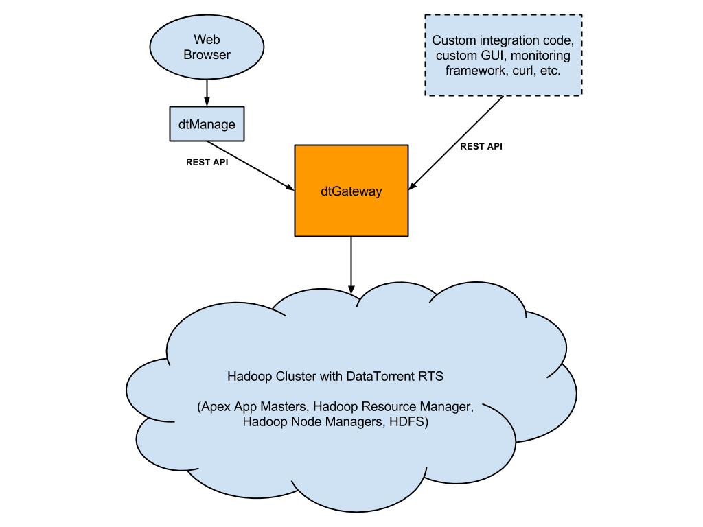

dtGateway
===================

One of the main components of DataTorrent RTS is dtGateway.  dtGateway is a window on your DataTorrent RTS platform. It is a Java-based multithreaded web server that allows you to easily access information and perform various operations on DataTorrent RTS, and it is the server behind [dtManage](dtmanage.md). It can run on any node in your Hadoop cluster or any other node that can access your Hadoop nodes, and is installed as a system service automatically by the RTS [installer](installation.md).

dtGateway constantly communicates with all the running Apex App Masters, as well as the Node Managers and the Resource Manager in the Hadoop cluster, in order to gather all the information and to perform all the operations users may need.



These features are exposed through a [REST API](dtgateway_api.md). Here are some of things you can do with the REST API:

- Get performance metrics (e.g. CPU, memory usage, tuples per second, latency, etc.) and other details of all Apex application instances
- Get performance metrics and other details of physical and logical operators of each Apex application instance
- Get performance metrics and other details of individual containers used by each Apex application instance
- Retrieve container logs
- Dynamically change operator properties, and add and remove operators from the DAG of a running Apex application
- Record and retrieve tuples on the fly
- Shutdown a running container or an entire Apex application
- Dynamically change logging level of a container
- Create, manage, and view custom system alerts
- Create, manage, and interact with dtDashboard
- Create, manage, and launch Apex App Packages
- Basic health checks of the cluster


## Security

With all the information dtGateway has and what dtGateway can do, the admin of DataTorrent RTS may want to restrict access to certain information and operations to only certain group of users. This means dtGateway must support authentication and authorization.  For authentication, dtGateway can easily be integrated with existing LDAP, Kerberos, or PAM framework.  You can also choose to have dtGateway manage its own user database.

For authorization, dtGateway provides built-in role-based access control. The admin can decide which roles can view what information and perform what operations in dtGateway. The user-to-role mapping can be managed by dtGateway, or be integrated with LDAP roles.  In addition, we provide access control with granularity to the application instance level as well as to the application package level. For example, you can control which users and which roles have read or write access to which application instances and to which application packages.

For information on configuring security see [dtGateway security](dtgateway_security.md) guide.

## System Alerts

The DT Gateway System Alerts provides a way for users to monitor metrics in the Hadoop cluster and of running applications.  When an alert condition becomes true continuously within the specified time set for that alert, the Gateway sends an email to the email address or addresses associated with that alert.  The same is true for alerts condition changing to a false state. The alert conditions are written in JavaScript. Alerts are created via the **PUT /ws/v2/systemAlerts/alerts/{name}** documented in the [REST API](dtgateway_api.md).
 For more detail documentation on System Alerts, please refer to [this document](dtgateway_systemalerts.md).


## Rest API

Here is an example of using the curl command to access dtGateway’s REST API to get the details of a physical operator with ID=40 of application instance with ID=application_1442448722264_14891, assuming dtGateway is listening at localhost:9090

```bash
$ curl http://localhost:9090/ws/v2/applications/application_1442448722264_14891/physicalPlan/operators/40
{
  "checkpointStartTime": "1442512091772",
  "checkpointTime": "175",
  "checkpointTimeMA": "164",
  "className": "com.datatorrent.contrib.kafka.KafkaSinglePortOutputOperator",
  "container": "container_e08_1442448722264_14891_01_000017",
  "counters": null,
  "cpuPercentageMA": "0.2039266316727741",
  "currentWindowId": "6195527785184762469",
  "failureCount": "0",
  "host": "node22.morado.com:8041",
  "id": "40",
  "lastHeartbeat": "1442512100742",
  "latencyMA": "5",
  "logicalName": "QueryResult",
  "metrics": {},
  "name": "QueryResult",
  "ports": [
    {
      "bufferServerBytesPSMA": "0",
      "name": "inputPort",
      "queueSizeMA": "1",
      "recordingId": null,
      "totalTuples": "6976",
      "tuplesPSMA": "0",
      "type": "input"
    }
  ],
  "recordingId": null,
  "recoveryWindowId": "6195527785184762451",
  "status": "ACTIVE",
  "totalTuplesEmitted": "0",
  "totalTuplesProcessed": "6976",
  "tuplesEmittedPSMA": "0",
  "tuplesProcessedPSMA": "20",
  "unifierClass": null
}
```

For the complete spec of the REST API, please refer to dtGateway [REST API](dtgateway_api.md).

For information on configuring dtGateway in general, see [DataTorrent RTS Configuration](configuration.md#configuration-files)
