# dtManage Guide

## Introduction

The DataTorrent Console (aka dtManage) is a web-based user interface that allows you to monitor and interact with the DataTorrent platform running on your Hadoop cluster. It is a web-based dashboard that is served by the DataTorrent Gateway, and has five areas: configuration, monitoring, development, and , visualization, and learning.

To download the platform or the VM sandbox, go to [http://www.datatorrent.com/download](http://www.datatorrent.com/download).

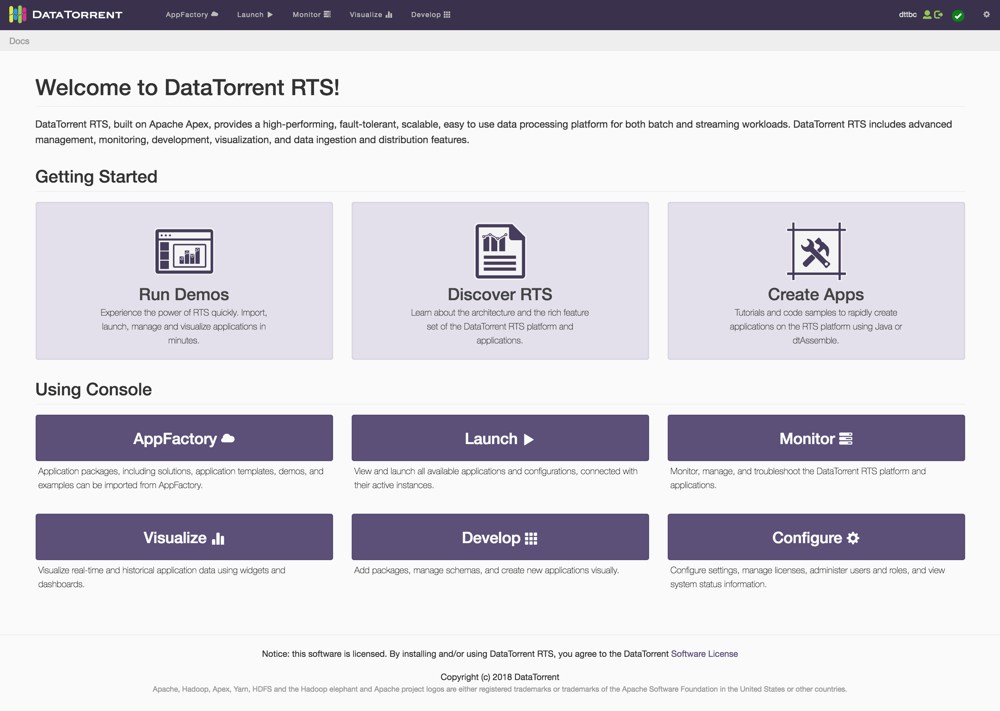

### Connection Requirements

When you install DataTorrent RTS on your Hadoop cluster using the installer binary, the DataTorrent Gateway service is started on the node where the installer is executed. By default, the Gateway serves the console from port 9090. The ability to connect to this node and port depends on your environment, and may require special setup such as an ssh tunnel, firewall configuration changes, VPN access, etc.

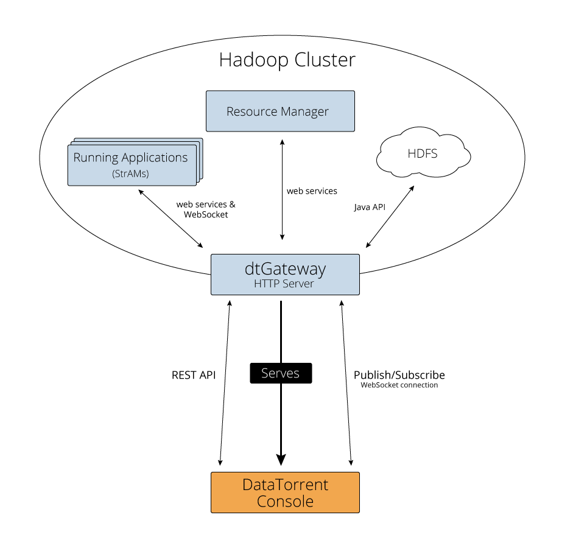

### Browser Requirements

The Console currently supports Chrome and Safari.

### Installation Wizard

The first time you open the Console, after installing DataTorrent RTS on your cluster, it will take you to the Installation Wizard. This walks you through the initial configuration of your DataTorrent installation, by confirming the following:

* Location of the hadoop executable
* DFS location where all the DataTorrent files are stored
* DataTorrent license
* Summary and review of any remaining configuration items

#### When Kerberos Security is Enabled

When your hadoop cluster has security enabled with Kerberos, there will be four additional controls in the installation wizard: 

- **Kerberos Principal**: The Kerberos principal (e.g. primary/instance@REALM) to use on behalf of the management console.
- **Kerberos Keytab**: The location (path) of the Kerberos keytab file to use on the gateway node's local file system.
- **YARN delegation token lifetime**: If the value of the `yarn.resourcemanager.delegation.token.max-lifetime` property in your cluster configuration has been changed from the default, enter it here. Otherwise, leave this blank and the default will be assumed.
- **Namenode delegation token lifetime**: If the value of the `dfs.namenode.delegation.token.max-lifetime` property in your cluster configuration has been changed from the default, enter it here. Otherwise, leave this blank and the default will be assumed.

> **Note:** The token lifetime values you enter will not actually set these values in your hadoop configuration, it is only meant to inform the DataTorrent platform of these values.

## Configure Tab

The configuration page can be found by clicking the “Configure” link in the main navigation bar at the top. There are links to various tools to help you configure and troubleshoot your DataTorrent installation. _The configuration page links may differ depending on your cluster setup. The following is a screenshot with a cluster that has simple authentication/authorization enabled._

### System Configuration

This page shows diagnostic information regarding the gateway and console, as well as any issues that the gateway may detect.

In addition, you can perform the following actions from this page:

#### Restart the Gateway

This can be useful when Hadoop configuration has changed or some other factor of your cluster environment has changed.

#### Toggle Reporting

If enabled, your DataTorrent installation will send various pieces of information such as bug reporting and usage statistics back to our servers.

### License Information

Use the License Information page to view how much of your DataTorrent license capacity your cluster is consuming as well as what capabilities your license permits. You can also upload new license files here.

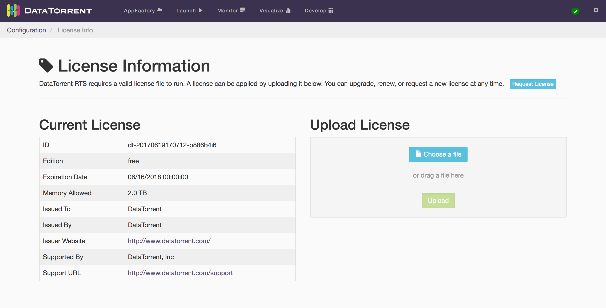

### User Profile

The User Profile page displays information about the current user, including their username, the authentication scheme being used, and the roles that the current user has. In addition, users can perform the following actions:

- change password 
- change the default home page
- change the theme of the console
- restore the default options of the console

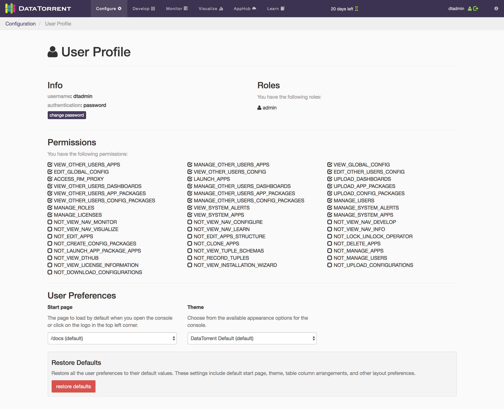

### User Management

Use this page to manage users and roles of your DataTorrent cluster:

*   add users
*   change users’ roles
*   change users’ password
*   delete users
*   add roles
*   edit role permissions
*   delete roles

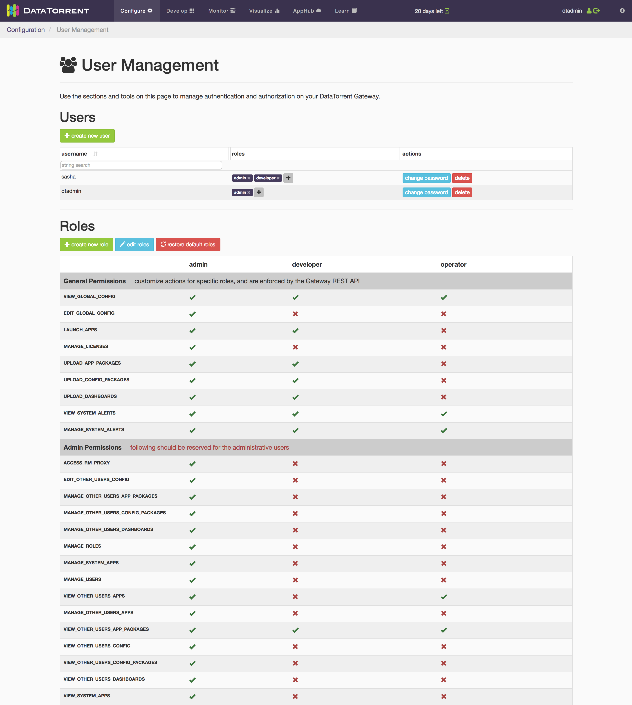

> **Note:** With most authentication schemes, the admin role cannot be deleted.

### Installation Wizard

At any time, you can go back to the installation wizard from the Configuration Tab. It can help diagnose issues and reconfigure your cluster and gateway.

## Develop Tab

The development area of dtManage is mainly geared towards the creation, upload, configuration, and launch of DataTorrent applications. The development home can be viewed by clicking the “Develop” tab in the main navigation bar on the top of the screen. A prerequisite to using the development tools of the UI is an understanding of what Apex Application Packages are. For more information, see the [Application Packages Guide](https://www.datatorrent.com/docs/guides/ApplicationDeveloperGuide.html).

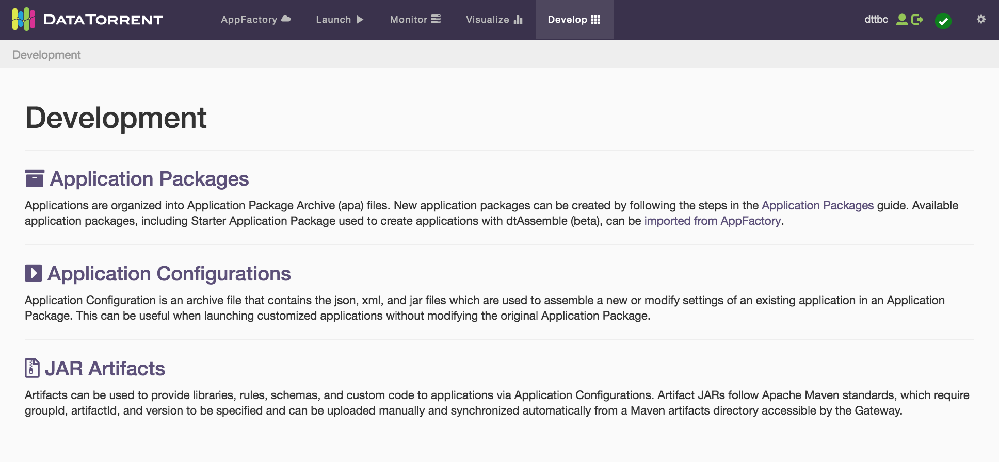

### Application Packages

To access the application package listing, click on the "Apps" link from the Develop Tab index page. From here, you can perform several operators directly on application packages:

- Download the app package
- Delete the app package
- Create a new application in an application package via dtAssemble (requires enterprise license)
- Launch applications in the app package
- Import default packages (see below)

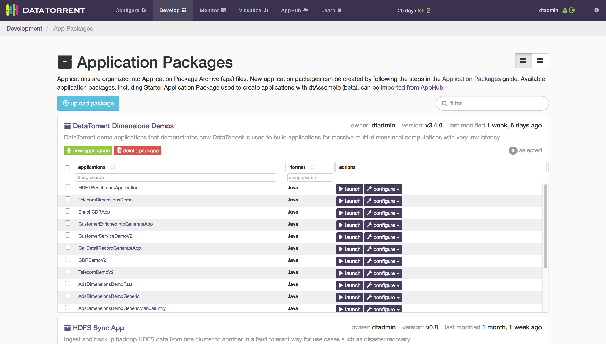

> **Note:** If authentication is enabled, you may not be able to see others’ app packages, depending on your permissions.

#### Importing Default Packages

When you install the DataTorrent platform, a folder located in the installation directory called `demos/app-packages` will contain various default app packages that can be imported into HDFS for use. Just above the list of Application Packages, there should be a button that says **Import default packages**. Clicking this will take you to a page that shows the list of these demo app packages. Select one or more to import and click the **Import** button. This will upload the selected app package to HDFS.

### Application Package Page

Once you have uploaded or imported an App Package, clicking on the package name in the list will take you to the Application Package Page, where you can view all the package details.

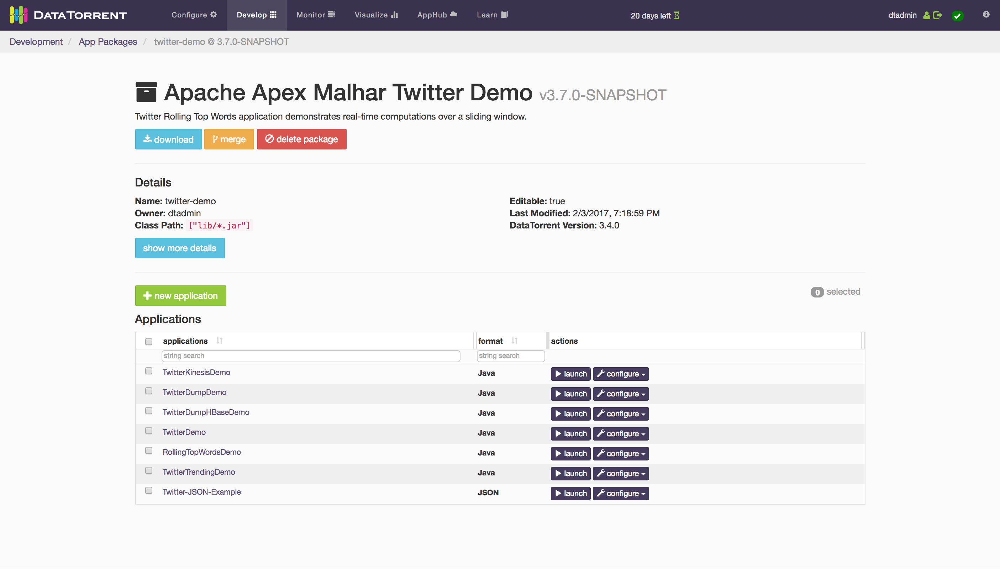

Aside from various pieces of meta information (owner, DataTorrent version, required properties, etc), you will see a list of apps found in this package. 

#### Launching Apps

To launch an app in an App Package, click on the launch button to the far right of the list. A dialog box will appear with several options: 

- **Specify a name for the running app**
  The console will pre-populate this field with an appropriate name, but you can specify your own name. Just be weary that it must be unique compared to the other applications running on your DataTorrent installation.
- **Specify the [scheduler queue](https://hadoop.apache.org/docs/r2.4.1/hadoop-yarn/hadoop-yarn-site/CapacityScheduler.html)**
  This input allows you to specify which queue you want the application to be launched under. The default behavior depends on your Hadoop installation, but typically will be `root.[USER_NAME]`.
- **Use a config file when launching**
  App Package config files are xml files that contain `<properties>` that get interpreted and used for launching an application. To choose one, enable the check box and choose the config file you want to use for launch.
- **Specify custom properties**
  In addition to choosing a config file, you may also specify properties directly in the launch popup by selecting this option. Note that there are three helpful functions when specifying custom properties:
  - *add required properties* - App Packages can have required properties (for example, twitter API access keys for the twitter demo). This function adds a new property with the required property name to the form, making it easy to fill in.
    - *add default properties* - App Packages can also have default properties. This function will add the default properties to the list, making it easy for you to override the defaults
    - *save this configuration as…* - This function creates a new config file and saves it to the App Package, which can then be used later to launch the app with. That way, you can relaunch the app with the same properties without having to re-enter them.

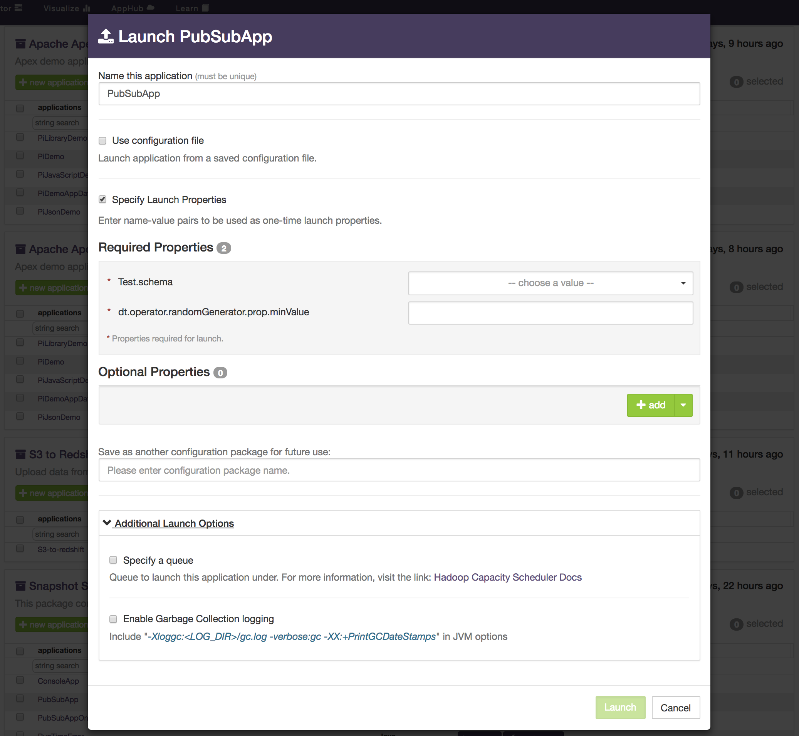

> **Note:** For more information about config files and custom properties, see the [Application Packages Guide](https://www.datatorrent.com/docs/guides/ApplicationDeveloperGuide.html)

### Viewing an Application DAG

All DataTorrent applications are made up of operators that connect together via streams to form a Directed Acyclic Graph (DAG). To see a visualization of this DAG, click on the application name in the list of applications.

### Creating apps with dtAssemble

If you have an Enterprise license, you will have access to the dtAssemble tool. Using this tool is outside the scope of this guide, but check out the [dtAssemble guide](http://docs.datatorrent.com/dtassemble/).

## Monitor Tab

The main operations dashboard can be visited by clicking on the “Monitor” link in the main top navigation bar. This section of the Console can be used to monitor, debug, and kill running DataTorrent applications.

### Operations Home

The operations home page shows overall cluster statistics as well as a list of running DataTorrent applications.

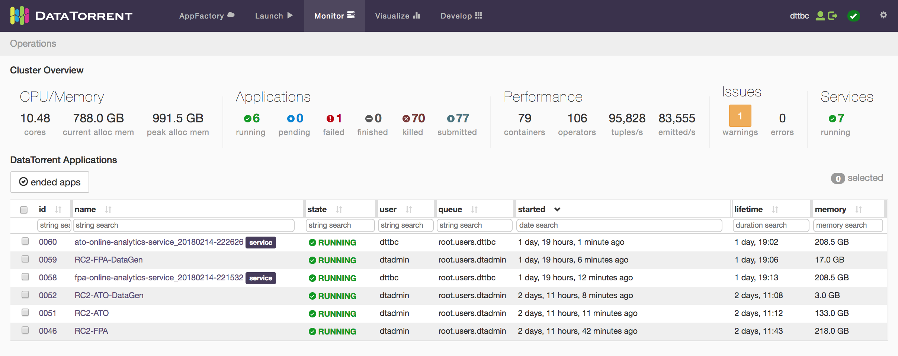

The cluster statistics include some performance statistics and memory usage information. As for the application list, there are two options to take note of: **retrieve ended apps** and **include system apps**. The first option will include all ended applications that are still in the resource manager history. The second option will include system apps, which are apps like the App Data Tracker that are developed by DataTorrent and used to add functionality to your DataTorrent cluster.

### Instance Page

To get to an application instance page, click on either the app name or the app id in the list of running applications.

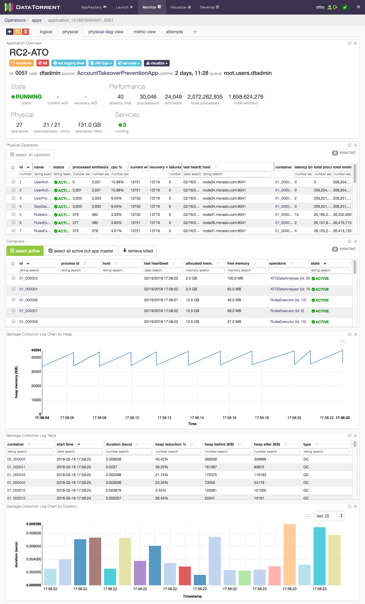

All sections and subsections of the instance page currently use a dashboard/widget system. The controls for this system are located near the top of the screen, below the breadcrumbs:

There are tool tips to help you understand how to work with dashboards and widgets. For most users, the default dashboard configurations (*logical*, *physical*, *physical-dag-view*, *metric-view*) will suffice. The following is a list of widgets available on an app instance page:

#### Application Overview Widget

All the default dashboard tabs have this widget. It contains basic information regarding the app plus a few controls. To end a running application, use either the “shutdown” or “kill” buttons in this widget:

The “shutdown” function tries to gracefully stop the application, while “kill” forces the application to end. In either case, you will need to confirm your action.

You can also use the **set logging level** button on this widget to specify what logging level gets written to the dt.log files. 

You will then be presented with a dialog where you can specify either fully-qualified class names or package identifiers with wildcards:

#### Stram Events Widget

Each application has a stream of notable events that can be viewed with the StrAM Events widget:

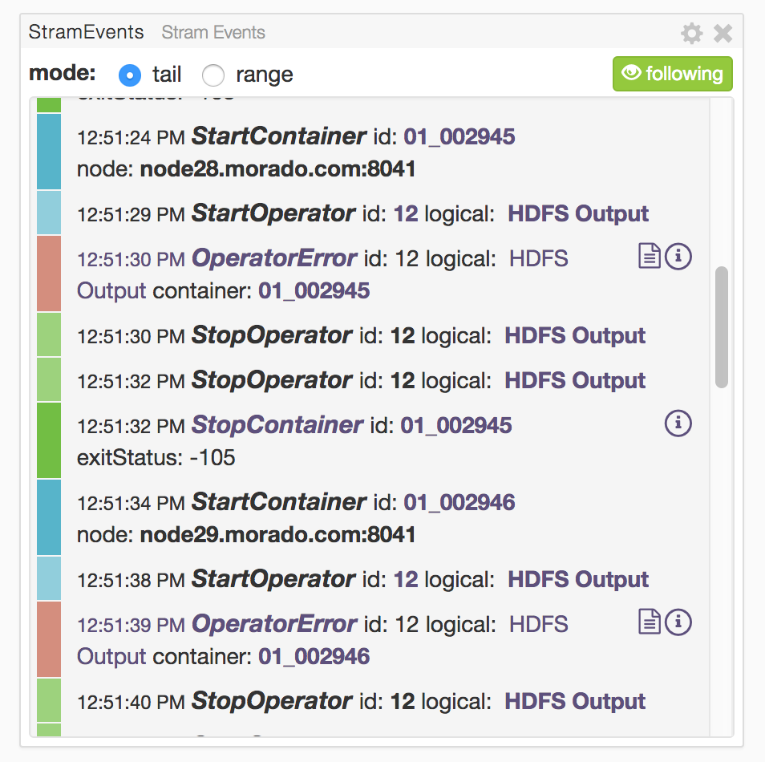

Some events have additional information attached to it, which can be viewed by clicking the “details” button in the list:

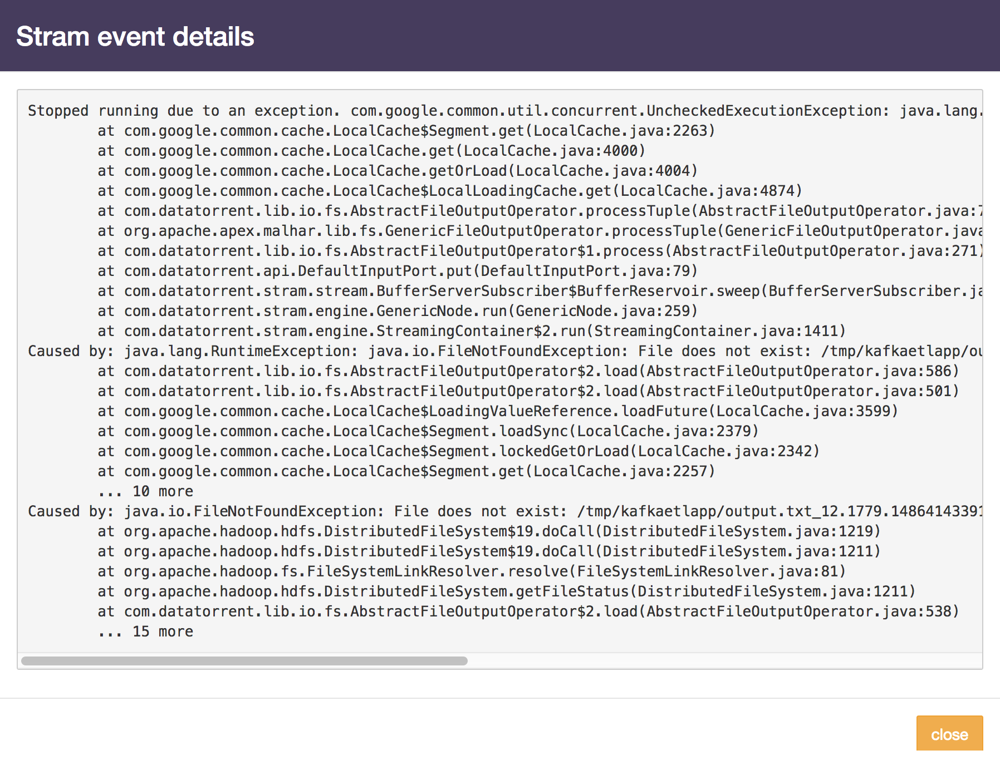

#### Logical DAG Widget

This widget visualizes the logical plan of the application being viewed:

Additionally, you can cycle through various metrics aggregated by logical operator. In the screenshot above, processed tuples per second and emitted tuples per second are shown. 

>**Pro tip:** Hold the alt/option key while using your mouse scroll wheel to zoom in and out on the DAG.

#### Physical DAG Widget

This is similar to the Logical DAG Widget, except it shows the fully deployed "physical" operators. Depending on the partitioning of your application, this could be significantly more complex than the Logical DAG view.

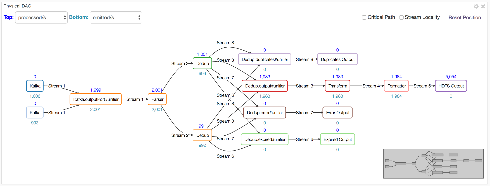

Same-colored physical operators in this widget indicates that these operators are in the same container.

#### Logical Operators List Widget

This widget shows a list of logical operators in the application. This table, like others, has live updates, filtering, column ordering, stacked row sorting, and column resizing. 

One nice feature specific to this widget is the ability to set the logging level for the Java class of a logical operator by selecting it in this list and using the provided dropdown, like so:

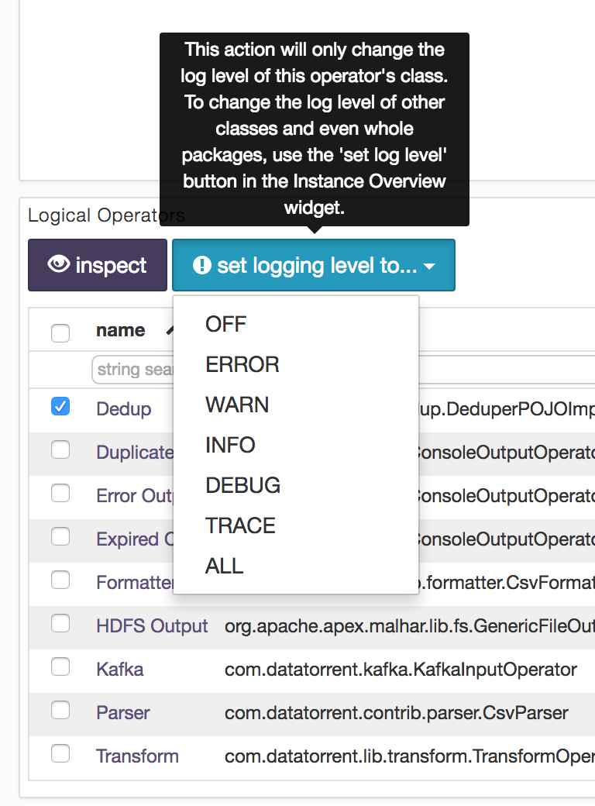

#### Physical Operators List Widget

Shows the physical operators in the application.

#### Containers List Widget

Shows the containers in the application. From this widget you can: select a container and go to one of its logs, fetch non-running containers and view information about them, and even kill selected containers.

#### Logical Streams List Widget

Shows a list of the streams in the application. There are also links to the logical operator pages for the sources and sinks of each stream.

#### Metrics Chart

Shows various metrics of your application on a real-time line chart. Single-click a metric to toggle its visibility. Double-click a metric to toggle all other keys' visibility.

### Recording and Viewing Sample Tuples

There is a mechanism called tuple recording that can be used to easily look at the content of tuples flowing through your application. To use this feature, select a physical operator from the Physical Operators List widget and click on the “record a sample” button. This will bring up a modal window which you can then use to traverse the sample and look at the actual content of the tuple (converted to a JSON structure):

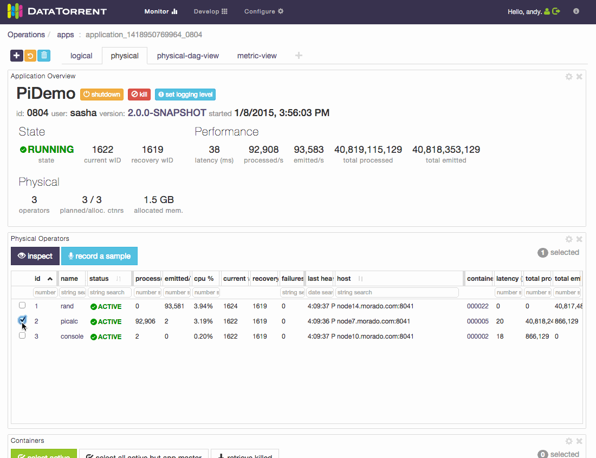

### Viewing Logs

Another useful feature of the Console is the ability to view container logs of a given application. To do this, select a container from the Containers List widget (default location of this widget is in the “physical” dashboard). Then click the logs dropdown and select the log you want to look at:

Once you are viewing a log file in the console, there are few tricks to traversing it. You can scroll to the top to fetch earlier content, scroll to the bottom for later content, grep for strings in the selected range or over the entire log, and click the “eye” icon to the far left of every line to go to that location of the log:

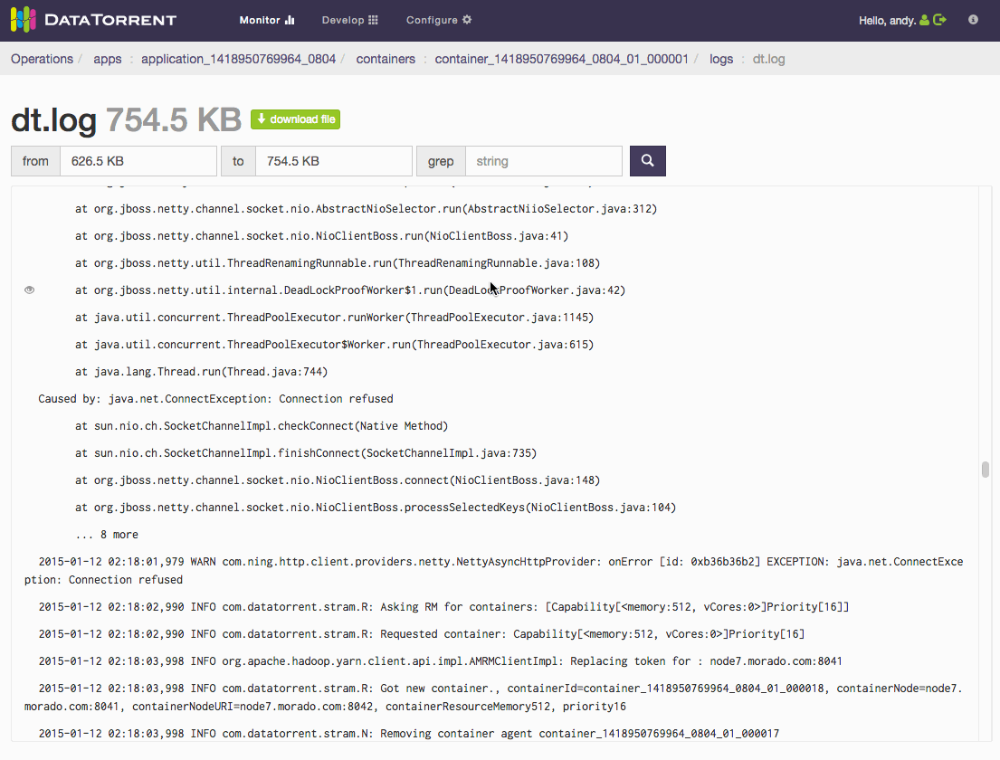

There are numerous improvements in store for dtManage, and user feedback is highly valued in the planning, so please provide any that will help in your usage of the tool!

~The DataTorrent UI Team

