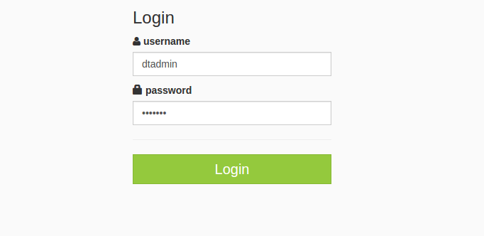

DataTorrent RTS Sandbox
================================================================================

Welcome to the DataTorrent Sandbox, an introduction to DataTorrent RTS, the industry’s only unified stream and batch processing platform.  For additional information about DataTorrent products, please visit https://www.datatorrent.com/

Sandbox Overview
--------------------------------------------------------------------------------

The DataTorrent Sandbox automatically launches Hadoop HDFS and YARN services on startup.  Depending on the host machine capabilities, these may take from several seconds to several minutes to start up.  Until Hadoop services are active and ready, it is normal to see error messages about availability of HDFS and YARN in the Issues section of the <a href="http://localhost:9090/" target="_blank">DataTorrent Console</a>.  Ensure there are no errors remaining in the Console by allowing sufficient time for Hadoop services startup prior to launching DataTorrent applications.

**Note**: By default, this sandbox is designed to run with 6 GB of RAM.  Limited resources may cause delays during Hadoop services and DataTorrent applications startup.

When accessing DataTorrent Console for the first time, you will be required to log in.  Use username **dtadmin** and password **dtadmin**.  Same credentials are also valid for sandbox system access.

Basic Demo Applications
--------------------------------------------------------------------------------

These applications require minimal resources and configuration changes and can be launched with a single click.  Ensure Hadoop [YARN](http://localhost:8088/cluster/cluster) and [HDFS](http://localhost:50070/dfshealth.jsp) are active and ready before launching DataTorrent demo applications.

1.  Navigate to <a href="http://localhost:9090/#/packages" target="_blank">App Packages</a> tab of the DataTorrent console, and select one of the demo packages.  In this example we will use **PiDemo** application package.

2.  From the list of available Applications, locate PiDemo and press the launch button.
    
    

3.  Proceed with default options on launch confirmation screen by pressing the Launch button.

4.  Once launched, view the running application by following the link provided in the launch confirmation dialog, or by navigating to the <a href="http://localhost:9090/#/ops" target="_blank">Monitor</a> section of the Console and selecting the launched application.

    

More information about using DataTorrent Console is available in [Console Guide](https://www.datatorrent.com/docs/guides/ConsoleGuide.html)

Advanced Demo Applications
--------------------------------------------------------------------------------

These applications may require additional configuration changes prior to launching.  Configuration changes can be made on the launch confirmation screen or manually applied to `~/.dt/dt-site.xml` configuration file.  These typically include adding Twitter API keys for twitter demo, or changing performance settings for larger applications.  Guides for various demo applications can be found in the [docs](http://docs.datatorrent.com/).

1.  Navigate to [App Packages](http://localhost:9090/#/packages) tab of the DataTorrent console, and select one of the demo packages.  In this example we will use [Twitter Demo](http://localhost:9090/#/packages) application package.

2.  From the list of Applications, select TwitterDemo and press the corresponding launch button.

3.  Retrieve Twitter API access information by registering for [Twitter Developer](https://dev.twitter.com/) account, creating a new [Twitter Application](https://apps.twitter.com/app/new), and navigating to Keys and Access Tokens tab.  Twitter Demo application requires the following to be specified by the user:

    dt.operator.TweetSampler.accessToken
    dt.operator.TweetSampler.accessTokenSecret
    dt.operator.TweetSampler.consumerKey
    dt.operator.TweetSampler.consumerSecret

4.  Select *Specify custom properties* on the launch confirmation screen, click *add required properties* button, and provide Twitter API access values.  Choose to save this configuration as `twitter.xml` file and proceed to Launch the application.

    

5.  Once launched, view the running application by following the link provided in the launch confirmation dialog, or by navigating to DataTorrent [Console](http://localhost:9090/#/ops) and selecting the launched application.

6.  View the top 10 tweeted hashtags in real time by generating and viewing the [dashboards](http://localhost:9090/#/dashboards).

Stopping Applications
--------------------------------------------------------------------------------

Applications can be shut down or killed from the [DataTorrent Console](/#ops) by selecting application from the list and clicking `shutdown` or `kill` buttons.

Managing Services
--------------------------------------------------------------------------------

DataTorrent Sandbox automatically launches following services on startup.

* Hadoop HDFS NameNode
* Hadoop HDFS DataNode
* Hadoop YARN ResourceManager
* Hadoop YARN NodeManager
* DataTorrent Gateway

All the services can be managed by right-clicking on `DataTorrent Services` desktop launcher.

*  Start Hadoop and DataTorrent services by right-clicking on `DataTorrent Services` desktop launcher and selecting `Start Hadoop and DataTorrent`
*  Shut down Hadoop and DataTorrent services by right-clicking on `DataTorrent Services` icon and selecting `Shut down Hadoop and DataTorrent`
*  Delete hdfs, tmp, and log files and restart all services by right-clicking on DataTorrent Services icon and selecting `Rebuild HDFS and Restart Services`

Support
--------------------------------------------------------------------------------

If you experience issues while experimenting with the sandbox, or have any feedback and comments, please let us know, and we will be happy to help!  Contact us using one of the methods listed on [datatorrent.com/contact](https://www.datatorrent.com/contact/) page.

