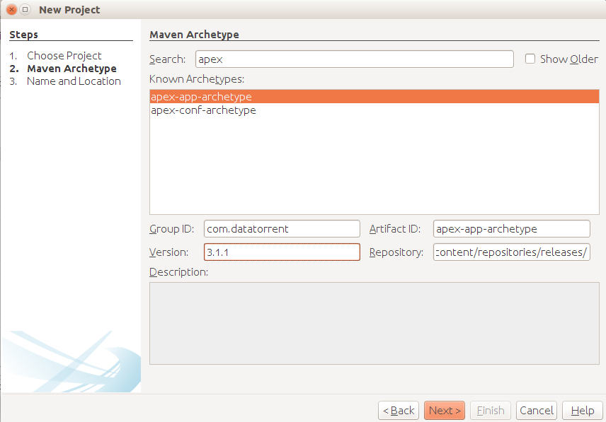
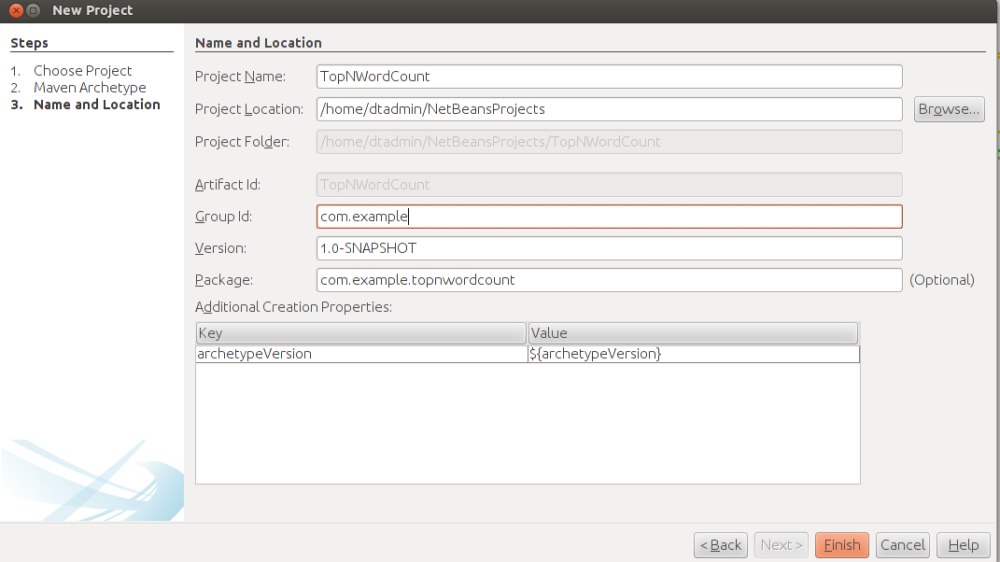

Building top N words using JAVA
===
This chapter describes the steps to build the application in Java using some
source files from the Malhar repository, suitably modified and customized to
run on the sandbox. We will use the **dtManage** GUI tool to launch the
application.

_Note_: You can build the top N words application using an IDE such as NetBeans
or maven on the command line. The following sections describe both ways.

Step I: Clone the Apex Malhar repository
---
Clone the Malhar repository (we will use some of these source files in a later
section):

1.  Open a terminal window and create a new directory where you want the code
    to reside, for example: `cd ~/src; mkdir dt; cd dt`

2.  Download the code for Malhar:

        git clone https://github.com/apache/incubator-apex-malhar

    You should now see a directory named `incubator-apex-malhar`.

3.  Navigate to the `incubator-apex-malhar` directory and switch to the
    `devel-3` branch:

        cd incubator-apex-malhar
        git checkout devel-3

Step II: Create the application project using NetBeans IDE
---
This section describes how to generate a new Apache Apex maven project using
the NetBeans IDE (downloadable from <https://netbeans.org/downloads/>). You can
also use other IDEs such as Eclipse if you wish. The next section describes an
alternative method of doing the same thing from the command-line without using
an IDE.

Generate a new Maven archetype project as follows:

  * Open NetBeans.
  * Click File &#x21e8; New Project.
  * From the projects list, select _Project from Archetype_, and click _Next_.
    

  * On the Maven Archetype window, type `apex` in the _Search_ box, and
     from the list of _Known Archetypes_, select `apex-app-archetype`.
     
  * Make sure that the values for the fields match the values shown in this
     table:

  <table>
  <colgroup>
  <col width="20%" />
  <col width="80%" />
  </colgroup>
  <tbody>
  <tr class="odd">
  <td align="left"><p>**Field**</p></td>
  <td align="left"><p>**Value**</p></td>
  </tr>
  <tr class="even">
  <td align="left"><p>Group ID</p></td>
  <td align="left"><p>com.datatorrent</p></td>
  </tr>
  <tr class="odd">
  <td align="left"><p>Artifact ID</p></td>
  <td align="left"><p>apex-app-archetype</p></td>
  </tr>
  <tr class="even">
  <td align="left"><p>Version</p></td>
  <td align="left"><p>3.1.1</p></td>
  </tr>
  <tr class="odd">
  <td align="left"><p>Repository</p></td>
  <td align="left"><p>https://www.datatorrent.com/maven/content/repositories/releases/</p></td>
  </tr>
  </tbody>
  </table>

  *  Click Next.
  *  On the _Name and Location_ window, do the following:

      1. Enter a name for this project in the _Project Name_ box, for example,
        `TopNWordCount`.
      2. Enter a location for this project in the _Project Location_ box, for
         example, `/home/dtadmin/NetBeansProjects`.
      3. Enter an ID in the _Group Id_ box, for example, `com.example`.
      4. Enter a version for this project in the _Version_ box, for example,
         `1.0-SNAPSHOT`.
      5. Enter the package name in the _Package_ box, for example,
          `com.example.topnwordcount`.

    

  * Click Finish.

The project is generated at the specified location and should be visible in
the left panel with the name _My Apex Application_. You can right-click the
project and choose _Rename_ to provide a more descriptive name such as
**TopNWordCount**.

---

Step II (Optional): Create the application project using the command line
---
The new maven project can be created using the command line (instead of an IDE)
as follows:

1. Copy this script to a simple text file named, for example, `newdt.sh`.

        #!/bin/bash
        # script to create a new project
        mvn archetype:generate \
        -DarchetypeRepository=https://www.datatorrent.com/maven/content/repositories/releases \
          -DarchetypeGroupId=com.datatorrent \
          -DarchetypeArtifactId=apex-app-archetype \
          -DarchetypeVersion=3.1.1 \
          -DgroupId=com.example \
          -Dpackage=com.example.topnwordcount \
          -DartifactId=topNwordcount \
          -Dversion=1.0-SNAPSHOT

2.  Run the file: `bash newdt.sh`

    _Note_: The command parameters might require minor adjustments as newer
    versions of Apache Apex are released. The parameters are displayed when you run this command.

3.  Press _Enter_ when prompted with `Y : :`. A new project directory named
    `topNwordcount` containing source files for a simple application should
    appear.

Step III: Copy application files to the new project
---
We assume you now have a new project created via one of the two methods
outlined above. We will now copy over a few of the application files downloaded
in Step I to the appropriate subdirectory of the new project.

1. Delete files `Application.java` and `RandomNumberGenerator.java`
   under `src/main/java/com/example/topnwordcount`.
2.  Delete file `ApplicationTest.java` file under
   `src/test/java/com/example/topnwordcount`.
3.  Copy the following files from:

        incubator-apex-malhar/demos/wordcount/src/main/java/com/datatorrent/demos/wordcount/

    to 

        src/main/java/com/example/topnwordcount

    - ApplicationWithQuerySupport.java
    - FileWordCount.java
    - LineReader.java
    - WCPair.java
    - WindowWordCount.java
    - WordCountWriter.java
    - WordReader.java

4.  Copy the file `WordDataSchema.json` from 

        incubator-apex-malhar/demos/wordcount/src/main/resources/

    to 

        src/main/resources/

    in the new project.
    
    _Note_: This file defines the format of data sent to the visualization widgets within **dtDashboard**.

Step IV: Customize the application and operators
---
We will now customize the application so that we can build and run it in our
sandbox environment.

The first customization involves the package name within the files which
currently reflects the package from which they were copied. The relevant line
within each file might look like this:
```
package com.datatorrent.demos.wordcount;
```
Change this line to reflect the current location, for example:
```
package com.example.topnwordcount;
```
Note: This change is easily accomplished in NetBeans by opening each file,
clicking the red error icon in the left margin, and selecting the
_Change package declaration to com.example.topnwordcount_ entry from the
drop-down list. Do this for each Java file that you copied.

**Customize the operators**

The next customization involves the query operators: The new code has two
query operators that are embedded within other operators. Support for such
embedding is absent in the 3.1.1 code, so we must:

- Remove the embedding calls
- Add the operators directly to the DAG
- Connect these query operators to the rest of the DAG via suitable streams

_Note_: All the operators used in this application are described in detail in the
Appendix.

To make these changes, edit the file `ApplicationWithQuerySupport.java`:

1.  Remove the lines containing calls to `setEmbeddableQueryInfoProvider()`
    and add these two lines in their place:

        dag.addOperator("QueryFile",   wsQueryFile);  
        dag.addOperator("QueryGlobal", wsQueryGlobal);

2.  Add streams to connect the two query operators to the DAG by adding these
    lines before the four existing `addstream()` calls:

        dag.addStream("QueryFileStream", wsQueryFile.outputPort, snapshotServerFile.query);
        dag.addStream("QueryGlobalStream", wsQueryGlobal.outputPort, snapshotServerGlobal.query);

3.  Save the file.

**Note**: After you complete this procedure, the newly copied Java files
should not show the red error icon in the IDE.

**Customize the application configuration**

Lastly, you must add configure some properties of the application. These
properties accomplish the following aims:

- Limit the amount of memory used by most operators so that more memory can
  be allocated for `fileWordCount` which maintains the frequency counts.
- Set the locality of a couple of streams to `CONTAINER_LOCAL` to further
  reduce memory pressure (necessary on the memory-limited environment of the
  sandbox).
- Define the regular expression for matching the non-word string that
  delimits words.
- Define number of top (word, frequency) pairs we want output.
- Define the path to the monitored input directory where input files are
  dropped and the output directory (both HDFS) to which the per-file top N
  (word, frequency) pairs are output.
- Define the topics for sending queries and retrieving data for visualization.

To do this:

Open the src/main/resources/META-INF/properties.xml file, and replace its
content with the following:

```
<configuration>
 <property>
   <name>dt.attr.MASTER_MEMORY_MB</name>
   <value>500</value>
 </property> <property>
   <name>dt.application.*.operator.*.attr.MEMORY_MB</name>
   <value>200</value>
 </property> <property>
   <name>dt.application.TopNWordsWithQueries.operator.fileWordCount.attr.MEMORY_MB</name>
   <value>512</value>
 </property> <property>
   <name>dt.application.TopNWordsWithQueries.operator.lineReader.directory</name>
   <value>/tmp/test/input-dir</value>
 </property> <property>
   <name>dt.application.TopNWordsWithQueries.operator.wordReader.nonWordStr</name>
   <value>[\p{Punct}\s]+</value>
 </property> <property>
   <name>dt.application.TopNWordsWithQueries.operator.wcWriter.filePath</name>
   <value>/tmp/test/output-dir</value>
 </property> <property>
   <name>dt.application.TopNWordsWithQueries.operator.fileWordCount.topN</name>
   <value>10</value>
 </property> <property>
   <name>dt.application.TopNWordsWithQueries.stream.QueryFileStream.locality</name>
   <value>CONTAINER_LOCAL</value>
 </property> <property>
   <name>dt.application.TopNWordsWithQueries.stream.QueryGlobalStream.locality</name>
   <value>CONTAINER_LOCAL</value>
 </property> <property>
   <name>dt.application.TopNWordsWithQueries.operator.QueryFile.topic</name>
   <value>TopNWordsQueryFile</value>
 </property> <property>
   <name>dt.application.TopNWordsWithQueries.operator.wsResultFile.topic</name>
   <value>TopNWordsQueryFileResult</value>
 </property> <property>
   <name>dt.application.TopNWordsWithQueries.operator.QueryGlobal.topic</name>
   <value>TopNWordsQueryGlobal</value>
 </property> <property>
   <name>dt.application.TopNWordsWithQueries.operator.wsResultGlobal.topic</name>
   <value>TopNWordsQueryGlobalResult</value>
 </property> <property>
   <name>dt.application.TwitterDemo.operator.wsResult.numRetries</name>
   <value>2147483647</value>
 </property>
</configuration>
```

Step V: Build the top N words count application
---
To build the application from NetBeans

1.  Open NetBeans IDE.
2.  Right-click the project, and click _Build_.

Building the application from the command line is equally simple:

    cd topNwordcount; mvn clean package -DskipTests

In either case, if the build is successful, it should have created the
application package file
`topNwordcount/target/topNwordcount-1.0-SNAPSHOT.apa`.

Step VI: Upload the top N words application package
---
To upload the top N words application package

1. Log on to the DataTorrent Console using the default username and password
   (both are `dtadmin`).
2. On the top navigation bar, click _Develop_.
3. Under _App Packages_, click _upload a package_.  
  
4. Navigate to the location of the `topNwordcount-1.0-SNAPSHOT.apa`
   application package file is stored.
5. Wait till the package is successfully uploaded.

Step VII: Launch the top N words application
---
_Note_: Before launching the top N words application, shut down the IDE. If your
IDE is running at the time of a launch, the sandbox might hang due to resource
exhaustion.

1. Log on to the DataTorrent Console (the default username and password are
   both `dtadmin`).
2. In the top navigation bar, click _Develop_.
3. Under _App Packages_, locate the top N word count application, and click
   _Launch Application_.
4. (Optional) To configure the application using a configuration file, select
    _Use a config file_. To specify individual properties, select _Specify
    custom properties_.
5. Click Launch.

A message indicating success of the launch operation should appear along with
the application ID.

_Note_: After a successful launch, monitor the top N words application following
instructions in the chapter _Monitoring with dtManage_.
