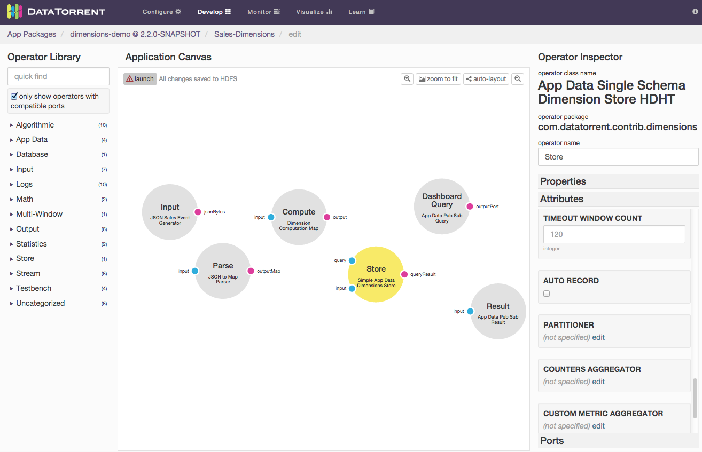
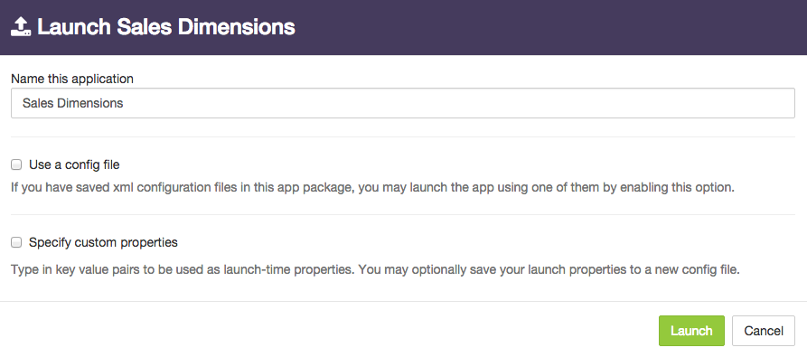
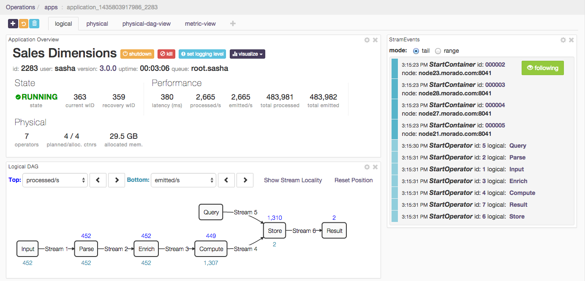
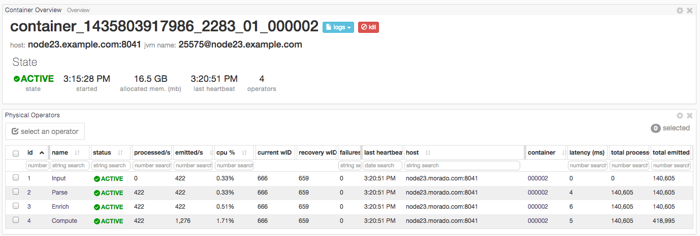
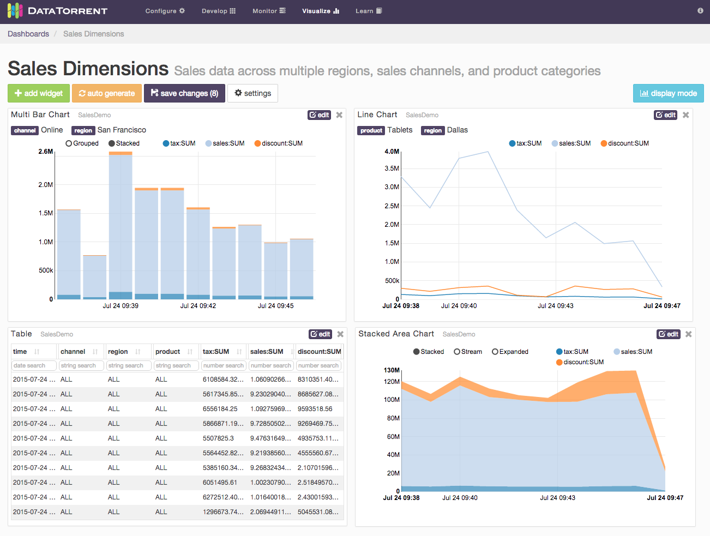

Sales Dimensions - Transform, Analyze and Alert
===============================================

Sales Dimensions application demonstrates multiple features of the DataTorrent platform, including ability to transform, analyze, and take actions on data in real time.  The application also demonstrates how DataTorrent platform is can be used to build scalable applications for high volume multi-dimensional computations with very low latency using existing library operators.

A large national retailer with physical stores and online sales channels is trying to gain better insights and improve decision making for their business.  By utilising real time sales data they would like to detect and forecast customer demand across multiple product categories, gage pricing and promotional effectiveness across regions, and drive additional customer loyalty with real time cross purchase promotions.

In order to achieve these goals, they need to be able to analyze large volumes of transactions in real time by computing aggregations of sales data across multiple dimensions, including retail channels, product categories, and regions.  This allows them to not only gain insights by visualizing the data for any dimension, but also make decisions and take actions on the data in real time.

Application setup will require following steps:

1.  **Input** - receive individual sales transactions
2.  **Transform** - convert incoming records into consumable form
3.  **Enrich** - provide additional information for each record by performing additional lookups
4.  **Compute** - perform aggregate computations on all possible key field combinations
5.  **Store** - store computed results for further analysis and visualizations
6.  **Analyze**, Alert & Visualize - display graphs for selected combinations, perform analysis, and take actions on computed data in real time.

## Create New Application

DataTorrent platforms supports building new applications with [Graphical Application Builder](dtassemble.md), which will be used for Sales Dimensions demo.  App Builder is an easy and intuitive way to construct your applications, which provides a great visualization of the logical operator connectivity and application data flow.

Go to App Packages section of the Console and make sure DataTorrent Dimensions Demos package is imported.  Use Import Demos button to add it, if not already present.
Click create new application, and name the application “Sales Dimensions”.

This will bring up the Application Builder interface




## Add and Connect Operators

From the Operator Library section on the App Builder screen, select the following operators and drag them to the Application Canvas.  Rename them to the names in parenthesis.

1.  **JSON Sales Event Generator (Input)** - generates synthetic sales events and emits them as JSON string bytes.
2.  **JSON to Map Parser (Parse)** - transforms JSON data to Java maps, which provides a way to easily transform and analyze the sales data.
3.  **Enrichment (Enrich)** - performs category lookup based on incoming product IDs, and adds the category ID to the output maps.
4.  **Dimension Computation Map (Compute)** -  performs dimensions computations, also known as cubing, on the incoming data.  This pre-computes the sales numbers by region, product category, customer, and sales channel, and all combinations of the above.  Having these numbers available in advance, allows for viewing and taking action on any of these combinations in real time.
5.  **Simple App Data Dimensions Store (Store)** - stores the computed dimensional information on HDFS in an optimized manner.
6.  **App Data Pub Sub Query (Query)** - dashboard connector for visualization queries.
7.  **App Data Pub Sub Result (Result)** - dashboard connector for visualization data results.

Connect all the operators together by clicking on the output port of the upstream operator, dragging connection, and connecting to the input port of the downstream operator.  Use the example below for layout and connectivity reference.


## Customize Application and Operator Settings

By clicking on the individual operators or streams connecting them, and using Operator Inspector panel on the right, edit the operator and stream settings as follows:

1.  Copy the Sales schema below and paste the contents into the *Event Schema JSON* field of **Input** operator, and *Configuration Schema JSON* of the **Compute** and **Store** operators.

        {
          "keys":[{"name":"channel","type":"string","enumValues":["Mobile","Online","Store"]},
                  {"name":"region","type":"string","enumValues":["Atlanta","Boston","Chicago","Cleveland","Dallas","Minneapolis","New York","Philadelphia","San Francisco","St. Louis"]},
                  {"name":"product","type":"string","enumValues":["Laptops","Printers","Routers","Smart Phones","Tablets"]}],
         "timeBuckets":["1m", "1h", "1d"],
         "values":
          [{"name":"sales","type":"double","aggregators":["SUM"]},
           {"name":"discount","type":"double","aggregators":["SUM"]},
           {"name":"tax","type":"double","aggregators":["SUM"]}],
         "dimensions":
          [{"combination":[]},
           {"combination":["channel"]},
           {"combination":["region"]},
           {"combination":["product"]},
           {"combination":["channel","region"]},
           {"combination":["channel","product"]},
           {"combination":["region","product"]},
           {"combination":["channel","region","product"]}]
        }

2.  Set the *Topic* property for **Query** and **Result** operators to ```SalesDimensionsQuery``` and ```SalesDimensionsResult``` respectively.
3.  Select the **Store** operator, and edit the *File Store* property.  Set the *Base Path* to ```SalesDimensionsDemoStore``` value.  This sets the HDHT storage path to write dimensions computation results to the ```/user/<username>/SalesDimensionsDemoStore``` on HDFS.

    

4.  Click on the stream and set the *Stream Locality* to ```CONTAINER_LOCAL``` for all the streams between **Input** and **Compute** operators.  Changing stream locality controls which container operators get deployed to, and can lead to significant performance improvements for an application.  Once set, connection will be represented by a dashed line to indicate the new locality setting.


## Launch Application

Once application is constructed, and validation checks are satisfied, a launch button will become available at the top left of the Application Canvas screen.  Clicking it will bring up the application launch dialog, which allows you to further configure the application by changing its name and configuration settings prior to starting it. 



After launching, go to *Sales Dimensions* application operations page in the [Monitor](/#/ops) section.



Confirm that the application is launched successfully by looking for *Running* state in the **Application Overview** section, and all confirming all the operators are successfully started under **Stram Events** section.  By navigating to **Physical** view tab, and looking at **Input**, **Parse**, **Enrich**, or **Compute** operators, notice that they are all deployed to the single container, thanks to the stream locality setting of ```CONTAINER_LOCAL``` we applied earlier.  This represents one of the many performance improvement techniques available with the DataTorrent platform, in this case eliminating data serialization and networking stack overhead between a group of adjacent operators.




## Visualize Data

DataTorrent includes powerful data visualization tools, which allow you to visualize streaming data from multiple sources in real time.  For additional details see [Data Visualization](dtdashboard.md) tutorial.

After application is started, a **visualize** button, available in the **Application Overview** section, can be used to quickly generate a new dashboard for the Sales Dimensions application.


Once dashboard is created, additional widgets can be added to display various dimensions and combinations of the sales data.  Below is an example of multiple sales combinations displayed in real time.




